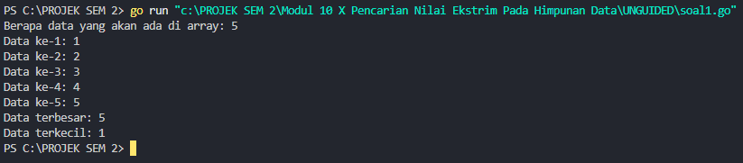
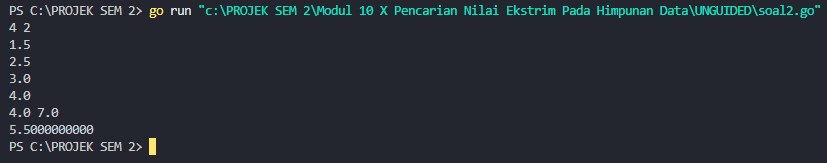
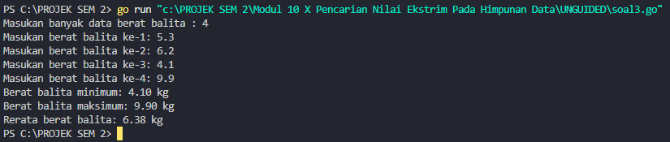

<h1 align="center">Laporan Praktikum Modul 10 <br>Pencarian Nilai Ekstrim Pada Himpunan Data</h1>

<p align="center">KHANIF YUNAN PRATAMA - 103112430017</p>
## Dasar Teori
Modul ini membahas tentang pencarian nilai ekstrem, yaitu nilai maksimum dan minimum, dalam sebuah himpunan data. Proses pencarian dilakukan secara sekuensial, dimulai dengan menganggap elemen pertama sebagai nilai ekstrem sementara, kemudian dibandingkan dengan elemen berikutnya untuk memperbarui nilai jika ditemukan yang lebih ekstrem. Ini mencakup implementasi pencarian pada array bertipe data dasar seperti int, serta pada array bertipe data terstruktur seperti struct mahasiswa. Selain mencari nilai ekstrem itu sendiri, juga dijelaskan cara mencari indeks dari nilai tersebut agar informasi yang diperoleh lebih lengkap.

---
## Unguided
### Soal 1
> Sebuah program digunakan untuk mendata berat anak kelinci yang akan dijual ke pasar. Program ini menggunakan array dengan kapasitas 1000 untuk menampung data berat anak kelinci yang akan dijual. Masukan terdiri dari sekumpulan bilangan, yang mana bilangan pertama adalah bilangan bulat N yang menyatakan banyaknya anak kelinci yang akan ditimbang beratnya. Selanjutnya N bilangan riil berikutnya adalah berat dari anak kelinci yang akan dijual. Keluaran terdiri dari dua buah bilangan riil yang menyatakan berat kelinci terkecil dan terbesar.
```go
package main

import "fmt"

type arrKelinci []int

func dataKelinci(n int) arrKelinci {
	var (
		kelinci int
		array   arrKelinci
	)

	for i := 0; i < n; i++ {
		fmt.Print("Data ke-", i+1, ": ")
		fmt.Scan(&kelinci)
		array = append(array, kelinci)
	}
	return array
}

func sortirKelinci(array arrKelinci, n int) (int, int) {
	max := array[0]
	min := array[0]

	for i := 0; i < n; i++ {
		if array[i] > max {
			max = array[i]
		}
		if array[i] < min {
			min = array[i]
		}
	}
	return max, min
}

func main() {
	var n int
	fmt.Print("Berapa data yang akan ada di array: ")
	fmt.Scan(&n)

	if n > 1000 {
		fmt.Println("Kapasitas maksimal adalah 1000 data")
	} else {
		data := dataKelinci(n)
		max, min := sortirKelinci(data, n)
		fmt.Println("Data terbesar:", max)
		fmt.Println("Data terkecil:", min)
	}
}
```


##### Penjelasan

Program ini dimulai dengan meminta input dari pengguna untuk menentukan jumlah data kelinci yang akan dimasukkan. Apabila jumlah data yang diberikan melebihi batas maksimum 1000, program akan berhenti dan menampilkan pesan peringatan. Namun, jika jumlah data yang dimasukkan valid, program akan melanjutkan untuk meminta data kelinci sesuai jumlah tersebut melalui pemanggilan fungsi `dataKelinci`. Setelah semua data terkumpul, program akan memproses data tersebut untuk mencari nilai terbesar (maksimum) dan terkecil (minimum) dengan menggunakan fungsi `sortirKelinci`. Hasil dari nilai maksimum dan minimum kemudian akan ditampilkan kepada pengguna.

---
### Soal 2
> Sebuah program digunakan untuk menentukan tarif ikan yang akan dijual ke pasar. Program ini menggunakan array dengan kapasitas 1000 untuk menampung data berat ikan yang akan dijual. Masukan terdiri dari dua baris, yang mana baris pertama terdiri dari dua bilangan bulat x dan y. Bilangan x menyatakan banyaknya ikan yang akan dijual, sedangkan y adalah banyaknya ikan yang akan dimasukan ke dalam wadah. Baris kedua terdiri dari sejumlah x bilangan riil yang menyatakan banyaknya ikan yang akan dijual. Keluaran terdiri dari dua baris. Baris pertama adalah kumpulan bilangan riil yang menyatakan total berat ikan di setiap wadah (jumlah wadah tergantung pada nilai x dan y, urutan ikan yang dimasukan ke dalam wadah sesuai urutan pada masukan baris ke-2). Baris kedua adalah sebuah bilangan riil yang menyatakan berat rata-rata ikan di setiap wadah.
```go
package main

import "fmt"

type arrIkan []float32

func dataIkan(x int) arrIkan {
	var (
		ikan  float32
		array arrIkan
	)

	for i := 0; i < x; i++ {
		fmt.Scan(&ikan)
		array = append(array, ikan)
	}
	return array
}

func kelompokIkan(data arrIkan, x, y int) ([]float32, float32) {
	var (
		totalWadah        []float32
		totalSemua, total float32
		jumlahWadah       int
	)

	for i := 0; i < x; i += y {
		total = 0
		for j := i; j < i+y && j < x; j++ {
			total += data[j]
		}
		totalWadah = append(totalWadah, total)
		totalSemua += total
		jumlahWadah++
	}

	rataRata := totalSemua / float32(jumlahWadah)
	return totalWadah, rataRata
}

func hasil(wadah []float32, rataRata float32) {
	for i := 0; i < len(wadah); i++ {
		fmt.Printf("%.1f ", wadah[i])
	}
	fmt.Println()
	fmt.Printf("%.10f\n", rataRata)
}

func main() {
	var x, y int
	fmt.Scan(&x, &y)

	if x > 1000 {
		fmt.Println("Kapasitas maksimal adalah 1000 data")
	} else {
		data := dataIkan(x)
		totalWadah, rata := kelompokIkan(data, x, y)
		hasil(totalWadah, rata)
	}
}
```


##### Penjelasan

Saat program ini dijalankan, pertama-tama pengguna diminta untuk memasukkan dua angka: jumlah data ikan (x) dan jumlah maksimum data per kelompok (y). Setelah itu, program akan menerima input berat ikan sebanyak x kali dan menyimpannya dalam array `arrIkan`. Setelah seluruh data selesai dimasukkan, program akan membagi data ke dalam beberapa kelompok, masing-masing berisi paling banyak y data. Untuk setiap kelompok, program akan menghitung total berat ikan, lalu menghitung rata-rata dari semua total berat kelompok tersebut. Di akhir, program akan menampilkan total berat masing-masing kelompok beserta nilai rata-rata dari total keseluruhan.

---
### Soal 3
> Pos Pelayanan Terpadu (posyandu) sebagai tempat pelayanan kesehatan perlu mencatat data berat balita (dalam kg). Petugas akan memasukkan data tersebut ke dalam array. Dari data yang diperoleh akan dicari berat balita terkecil, terbesar, dan reratanya.
```go
package main

import "fmt"

type arrBalita []float64

func hitungMinMax(arrBerat arrBalita, bMin, bMax *float64) {
	*bMin = arrBerat[0]
	*bMax = arrBerat[0]

	for i := 1; i < len(arrBerat); i++ {
		if arrBerat[i] < *bMin {
			*bMin = arrBerat[i]
		}
		if arrBerat[i] > *bMax {
			*bMax = arrBerat[i]
		}
	}
}

func rerata(arrBerat arrBalita) float64 {
	var total float64
	for i := 0; i < len(arrBerat); i++ {
		total += arrBerat[i]
	}
	return total / float64(len(arrBerat))
}

func main() {
	var (
		n        int
		array    arrBalita
		berat    float64
		min, max float64
	)

	fmt.Print("Masukan banyak data berat balita : ")
	fmt.Scan(&n)

	for i := 0; i < n; i++ {
		fmt.Printf("Masukan berat balita ke-%d: ", i+1)
		fmt.Scan(&berat)
		array = append(array, berat)
	}

	hitungMinMax(array, &min, &max)
	avg := rerata(array)

	fmt.Printf("Berat balita minimum: %.2f kg\n", min)
	fmt.Printf("Berat balita maksimum: %.2f kg\n", max)
	fmt.Printf("Rerata berat balita: %.2f kg\n", avg)
}
```


##### Penjelasan

Program ini dibuat untuk menghitung nilai berat minimum, maksimum, serta rata-rata dari sejumlah data berat balita yang dimasukkan oleh pengguna. Ketika program dijalankan, pengguna terlebih dahulu diminta untuk menginput jumlah data (n), kemudian diikuti dengan berat masing-masing balita. Semua data berat balita tersebut disimpan dalam sebuah slice dengan tipe `arrBalita` (alias dari `float64`).
Setelah seluruh data selesai dimasukkan:
1. Prosedur `hitungMinMax` digunakan untuk mencari dan menyimpan nilai berat minimum dan maksimum. Proses penyimpanan dilakukan melalui pointer.
2. Fungsi `rerata` digunakan untuk menghitung rata-rata berat balita.
Di akhir program, hasil berupa nilai berat minimum, maksimum, dan rata-rata akan ditampilkan dengan format dua angka di belakang koma.