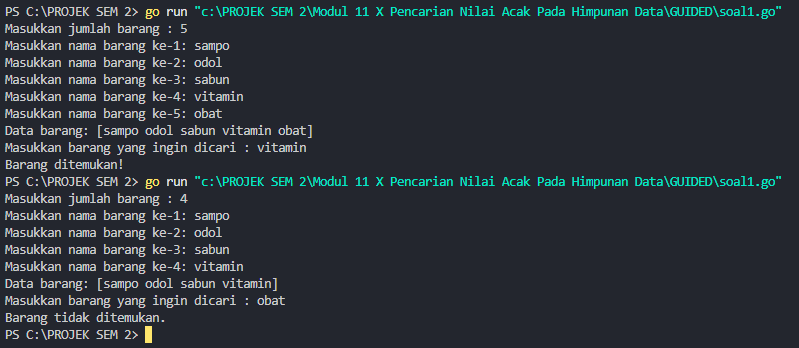
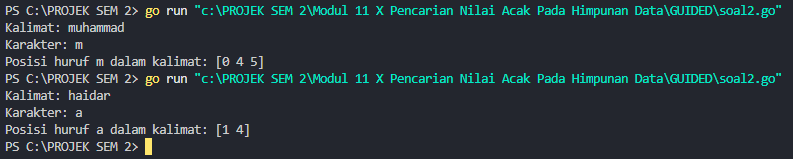
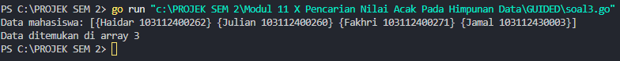
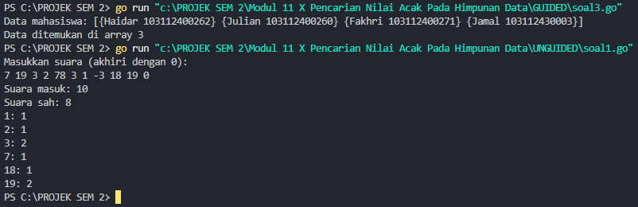
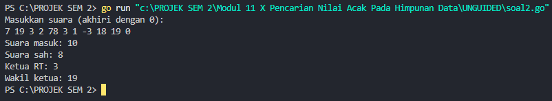
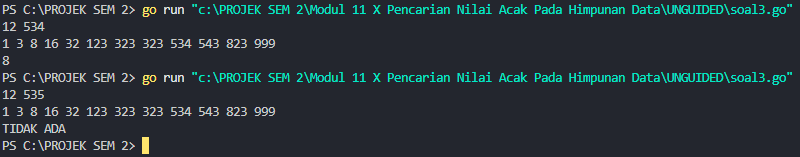

<h1 align="center">Laporan Praktikum Modul 11 <br>Pencarian Nilai Acak Pada Himpunan Data</h1>
<p align="center">Muhammad Haidar Amanullah - 103112400262</p>

# Dasar Teori
Pencarian Nilai Acak pada Himpunan Data mencakup dua algoritma utama, yaitu Sequential Search dan Binary Search. Sequential Search atau pencarian sekuensial dilakukan dengan memeriksa setiap elemen dalam array satu per satu hingga elemen yang dicari ditemukan atau seluruh data telah diperiksa. Algoritma ini cocok digunakan pada data yang tidak terurut. Sementara itu, Binary Search adalah algoritma yang lebih efisien untuk mencari data dalam array yang sudah terurut, dengan cara membagi ruang pencarian menjadi dua bagian dan memeriksa elemen tengah untuk menentukan arah pencarian selanjutnya. Binary search hanya akan berjalan dengan benar jika data terurut sesuai dengan kriteria pencarian, baik secara ascending maupun descending. Kedua metode ini juga dapat diterapkan pada array bertipe data dasar maupun struct, dengan penyesuaian pada field yang digunakan untuk pencarian​.

---
# Guided

## Soal 1
```go
package main

import "fmt"

type array []string

func dataBarang(n int) array {
	var barang string
	var arrayBarang array

	for i := 0; i < n; i++ {
		fmt.Print("Masukkan nama barang ke-", i+1, ": ")
		fmt.Scan(&barang)
		arrayBarang = append(arrayBarang, barang)
	}
	return arrayBarang
}

func cariArray(arrayBarang array, x string) bool {
	for i := 0; i < len(arrayBarang); i++ {
		if arrayBarang[i] == x {
			return true
		}
	}
	return false
}

func main() {
	var n int
	var x string

	fmt.Print("Masukkan jumlah barang : ")
	fmt.Scan(&n)

	data := dataBarang(n)
	fmt.Println("Data barang:", data)

	fmt.Print("Masukkan barang yang ingin dicari : ")
	fmt.Scan(&x)

	barang := cariArray(data, x)

	if barang {
		fmt.Println("Barang ditemukan!")
	} else {
		fmt.Println("Barang tidak ditemukan.")
	}
}
```


### Penjelasan
Program ini dimulai dengan meminta pengguna untuk memasukkan jumlah barang yang akan diinputkan. Setelah jumlahnya ditentukan, program akan meminta pengguna untuk memasukkan nama-nama barang sesuai jumlah tersebut. Nama-nama barang tersebut disimpan dalam array bertipe `string` melalui fungsi `dataBarang`.
Setelah semua data barang berhasil disimpan, program kemudian meminta pengguna untuk memasukkan nama barang yang ingin dicari. Proses pencarian dilakukan menggunakan fungsi `cariArray`, yang akan memeriksa setiap elemen array satu per satu dan mencocokkan dengan nama barang yang dimasukkan.
Jika barang ditemukan dalam array, program akan mencetak pesan bahwa barang tersebut ditemukan. Sebaliknya, jika barang tidak ada dalam array, program akan menampilkan pesan bahwa barang tidak ditemukan.

---
## Soal 2
```go
package main

import "fmt"

func pencarianHuruf(kalimat string, karakter string) []int {
	var posisi []int

	for i := 0; i < len(kalimat); i++ {
		if kalimat[i] == karakter[0] {
			posisi = append(posisi, i)
		}
	}
	return posisi
}
func main() {

	var kalimat, karakter string

	fmt.Print("Kalimat: ")
	fmt.Scan(&kalimat)

	fmt.Print("Karakter: ")
	fmt.Scan(&karakter)

	posisi := pencarianHuruf(kalimat, karakter)

	if len(posisi) > 0 {
		fmt.Println("Posisi huruf", karakter, "dalam kalimat:", posisi)
	} else {
		fmt.Println("Karakter", karakter, "tidak ditemukan dalam kalimat.")
	}
}
```


### Penjelasan
Program ini diawali dengan meminta pengguna untuk memasukkan sebuah kalimat dan satu karakter yang ingin dicari di dalam kalimat tersebut. Setelah input diterima, program akan memanggil fungsi `pencarianHuruf` untuk melakukan pencarian karakter tersebut dalam kalimat.
Fungsi `pencarianHuruf` bekerja dengan memeriksa setiap karakter pada kalimat satu per satu, kemudian mencatat posisi indeks di mana karakter yang dicari muncul. Semua posisi kemunculan karakter disimpan dalam sebuah slice.
Setelah proses pencarian selesai, program akan mengecek hasilnya. Jika karakter ditemukan dalam kalimat, program akan menampilkan semua posisi indeks kemunculan karakter tersebut. Sebaliknya, jika karakter tidak ada di dalam kalimat, program akan mencetak pesan yang menyatakan bahwa karakter tidak ditemukan.

---
## Soal 3
```go
package main

import "fmt"

type Mahasiswa struct {
	nama string
	nim  string
}

func binarySearch(mahasiswa []Mahasiswa, nimCari string) int {
	kiri := 0
	kanan := len(mahasiswa) - 1

	for kiri <= kanan {
		mid := (kiri + kanan) / 2

		if mahasiswa[mid].nim == nimCari {
			return mid
		} else if mahasiswa[mid].nim < nimCari {
			kiri = mid + 1
		} else {
			kanan = mid - 1
		}
	}

	return -1
}

func main() {
	var X string

	mahasiswa := []Mahasiswa{
		{nama: "Adi", nim: "103112430000"},
		{nama: "Faiz", nim: "103112430001"},
		{nama: "Nanda", nim: "103112430002"},
		{nama: "Ibang", nim: "103112430003"},
	}
	X = "103112430002"

	fmt.Println("Data mahasiswa:", mahasiswa)

	index := binarySearch(mahasiswa, X)

	if index != -1 {
		fmt.Printf("Data ditemukan di array %d\n", index)
	} else {
		fmt.Println("Mahasiswa dengan NIM tersebut tidak ditemukan.")
	}
}
```


### Penjelasan
Program ini digunakan untuk mencari data mahasiswa berdasarkan NIM.
- Data mahasiswa disimpan dalam **slice of struct** berisi nama dan NIM.
- Pencarian dilakukan dengan **binary search** pada data yang sudah terurut berdasarkan NIM.
- Jika NIM ditemukan, program akan mencetak indeks posisinya. Jika tidak, akan ditampilkan pesan **"Data mahasiswa tidak ditemukan."**

---
# Unguided
## Soal 1
> Pada pemilihan ketua RT yang baru saja berlangsung, terdapat 20 calon ketua yang bertanding memperebutkan suara warga. Perhitungan suara dapat segera dilakukan karena warga cukup mengisi formulir dengan nomor dari calon ketua RT yang dipilihnya. Seperti biasa, selalu ada pengisian yang tidak tepat atau dengan nomor pilihan di luar yang tersedia, sehingga data juga harus divalidasi. Tugas Anda untuk membuat program mencari siapa yang memenangkan pemilihan ketua RT. Buatlah program pilkart yang akan membaca, memvalidasi, dan menghitung suara yang diberikan dalam pemilihan ketua RT tersebut. 
> Masukan hanya satu baris data saja, berisi bilangan bulat valid yang kadang tersisipi dengan data tidak valid. Data valid adalah integer dengan nilai di antara 1 s.d. 20 (inklusif). Data berakhir jika ditemukan sebuah bilangan dengan nilai 0. 
> Keluaran dimulai dengan baris berisi jumlah data suara yang terbaca, diikuti baris yang berisi berapa banyak suara yang valid. Kemudian sejumlah baris yang mencetak data para calon apa saja yang mendapatkan suara.

```go
package main

import "fmt"

const maxCalon = 20

func inputSuara() ([]int, int) {
	var suara int
	var input []int

	fmt.Println("Masukkan suara (akhiri dengan 0):")
	for {
		fmt.Scan(&suara)
		if suara == 0 {
			break
		}
		input = append(input, suara)
	}

	return input, len(input)
}

func hitungSuara(input []int, totalMasuk int, perolehan *[]int) int {
	var totalSah int
	for j := 0; j < totalMasuk; j++ {
		s := input[j]
		if s >= 1 && s <= maxCalon {
			(*perolehan)[s]++
			totalSah++
		}
	}
	return totalSah
}

func tampilkanHasil(totalMasuk int, totalSah int, perolehan []int) {
	fmt.Printf("Suara masuk: %d\n", totalMasuk)
	fmt.Printf("Suara sah: %d\n", totalSah)

	for k := 1; k <= maxCalon; k++ {
		if perolehan[k] > 0 {
			fmt.Printf("%d: %d\n", k, perolehan[k])
		}
	}
}

func main() {
	var perolehan = make([]int, maxCalon+1)

	input, totalMasuk := inputSuara()
	totalSah := hitungSuara(input, totalMasuk, &perolehan)
	tampilkanHasil(totalMasuk, totalSah, perolehan)
}
```


### Penjelasan
Program ini digunakan untuk merekap hasil pemilihan ketua RT dengan maksimal 20 calon.
- Pengguna memasukkan suara dalam bentuk angka, berakhir saat angka 0 dimasukkan.
- Suara disimpan dalam slice, lalu dihitung suara sah menggunakan **fungsi hitungSuara** (angka 1–20 dianggap valid).
- Hasil rekap, termasuk total suara, jumlah suara sah, dan suara tiap calon, ditampilkan dengan **fungsi tampilkanHasil**.
---
## Soal 2
>Berdasarkan program sebelumnya, buat program pilkart yang mencari siapa pemenang pemilihan ketua RT. Sekaligus juga ditentukan bahwa wakil ketua RT adalah calon yang mendapatkan suara terbanyak kedua. Jika beberapa calon mendapatkan suara terbanyak yang sama, ketua terpilih adalah dengan nomor peserta yang paling kecil dan wakilnya dengan nomor peserta terkecil berikutnya. Masukan hanya satu baris data saja, berisi bilangan bulat valid yang kadang tersisipi dengan data tidak valid. Data valid adalah bilangan bulat dengan nilai di antara 1 s.d. 20 (inklusif). Data berakhir jika ditemukan sebuah bilangan dengan nilai 0. Keluaran dimulai dengan baris berisi jumlah data suara yang terbaca, diikuti baris yang berisi berapa banyak suara yang valid. Kemudian tercetak calon nomor berapa saja yang menjadi pasangan ketua RT dan wakil ketua RT yang baru.

```go
package main

import "fmt"

const maxCalon = 20

func inputSuara() ([]int, int) {
	var suara int
	var input []int

	fmt.Println("Masukkan suara (akhiri dengan 0):")
	for {
		fmt.Scan(&suara)
		if suara == 0 {
			break
		}
		input = append(input, suara)
	}

	return input, len(input)
}

func hitungSuara(input []int, totalMasuk int, perolehan []int) int {
	var totalSah int
	for j := 0; j < totalMasuk; j++ {
		s := input[j]
		if s >= 1 && s <= maxCalon {
			perolehan[s]++
			totalSah++
		}
	}
	return totalSah
}

func tampilkanHasil(totalMasuk int, totalSah int) {
	fmt.Printf("Suara masuk: %d\n", totalMasuk)
	fmt.Printf("Suara sah: %d\n", totalSah)
}

func cariKetuaWakil(perolehan []int) (int, int) {
	var ketua, wakil int
	var max1, max2 int

	for i := 1; i <= maxCalon; i++ {
		suara := perolehan[i]
		if suara > max1 {
			max2 = max1
			wakil = ketua

			max1 = suara
			ketua = i
		} else if suara == max1 && i < ketua {
			max2 = max1
			wakil = ketua

			ketua = i
		} else if suara > max2 {
			max2 = suara
			wakil = i
		} else if suara == max2 && i < wakil && i != ketua {
			wakil = i
		}
	}
	return ketua, wakil
}

func main() {
	perolehan := make([]int, maxCalon+1)

	input, totalMasuk := inputSuara()
	totalSah := hitungSuara(input, totalMasuk, perolehan)

	tampilkanHasil(totalMasuk, totalSah)

	ketua, wakil := cariKetuaWakil(perolehan)
	if totalSah > 0 {
		fmt.Printf("Ketua RT: %d\n", ketua)
		if wakil > 0 {
			fmt.Printf("Wakil ketua: %d\n", wakil)
		}
	}
}
```


### Penjelasan
Program ini melanjutkan program pemilihan ketua RT dengan maksimal 20 calon. Pengguna memasukkan suara hingga angka 0 sebagai tanda selesai. Suara dihitung dan diproses dengan fungsi **hitungSuara** untuk memisahkan suara sah (1–20) dan mencatat perolehan suara tiap calon. Fungsi **tampilkanHasil** menampilkan jumlah suara masuk dan suara sah.  
Program juga menentukan ketua dan wakil ketua berdasarkan jumlah suara terbanyak (prioritas calon bernomor lebih kecil jika jumlah suara sama) menggunakan fungsi **cariKetuaWakil**. Hasil akhir menampilkan nomor calon ketua dan wakil ketua jika ada suara sah.

---
## Soal 3
>Diberikan n data integer positif dalam keadaan terurut membesar dan sebuah integer lain k, apakah bilangan k tersebut ada dalam daftar bilangan yang diberikan? Jika ya, berikan indeksnya, jika tidak sebutkan "TIDAK ADA". Masukan terdiri dari dua baris. Baris pertama berisi dua buah integer positif, yaitu n dan k. n menyatakan banyaknya data, dimana 1 < n <= 1000000. k adalah bilangan yang ingin dicari. Baris kedua berisi n buah data integer positif yang sudah terurut membesar. Keluaran terdiri dari satu baris saja, yaitu sebuah bilangan yang menyatakan posisi data yang dicari (k) dalam kumpulan data yang diberikan. Posisi data dihitung dimulai dari angka 0. Atau memberikan keluaran "TIDAK ADA" jika data k tersebut tidak ditemukan dalam kumpulan. 

```go
package main

import "fmt"

const NMAX = 1000000

var data [NMAX]int

func isiArray(n int) {
	for i := 0; i < n; i++ {
		fmt.Scan(&data[i])
	}
}

func posisi(n, k int) int {
	low := 0
	high := n - 1

	for low <= high {
		mid := (low + high) / 2
		if data[mid] == k {
			return mid
		} else if data[mid] < k {
			low = mid + 1
		} else {
			high = mid - 1
		}
	}

	return -1
}

func main() {
	var n, k int
	fmt.Scan(&n, &k)

	isiArray(n)

	idx := posisi(n, k)
	if idx == -1 {
		fmt.Println("TIDAK ADA")
	} else {
		fmt.Println(idx)
	}
}
```


### Penjelasan
Program ini digunakan untuk mencari apakah sebuah angka tertentu terdapat dalam kumpulan angka yang telah dimasukkan oleh pengguna. Program meminta pengguna memasukkan sejumlah angka terlebih dahulu, lalu angka yang ingin dicari. Selanjutnya, data angka yang dimasukkan akan disimpan, diurutkan, dan dicari menggunakan metode **binary search**. Jika angka ditemukan, program akan menampilkan posisi kemunculannya dalam data; jika tidak, program akan menampilkan pesan bahwa angka tersebut tidak ada.