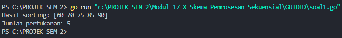
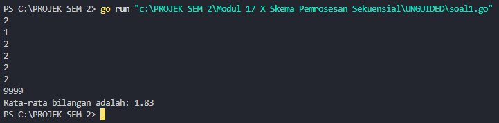
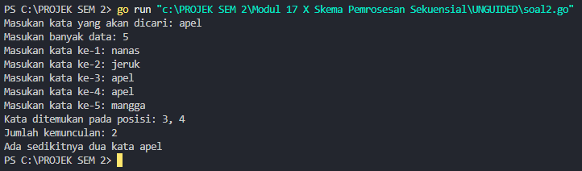
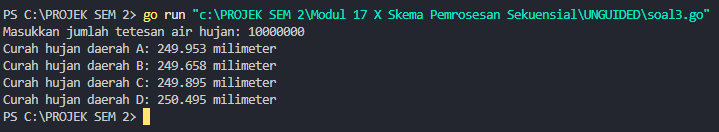
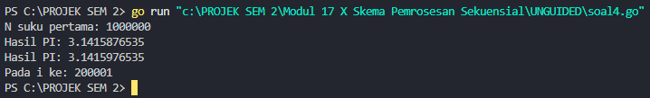
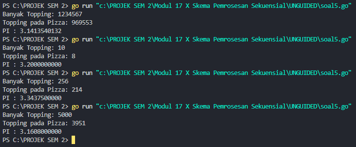

<h1 align="center">Laporan Praktikum Modul 17 <br>Skema Pemrosesan Sekuensial</h1>
<p align="center">Muhammad Haidar Amanullah - 103112400262</p>

# Dasar Teori
Skema pemrosesan sekuensial merupakan salah satu pola dasar dalam pemrograman algoritma yang digunakan untuk memproses data secara berurutan sesuai urutan masuknya data. Dalam pendekatan ini, data dapat dibaca dan diproses hingga jumlah tertentu (tanpa marker), atau hingga ditemukan penanda khusus (marker) yang menandai akhir data. Konsep ini penting karena memberikan kerangka berpikir sistematis dalam menyusun algoritma yang efisien, termasuk penanganan kondisi seperti data kosong, pemrosesan elemen pertama sebagai kasus khusus, dan pencarian nilai maksimum atau rata-rata dari sekumpulan data. Pendekatan sekuensial ini mencerminkan logika prosedural yang mendasari banyak algoritma dasar dalam ilmu komputer.

---
# Guided

## Soal 1
> Aldi memiliki daftar nilai ulangan matematika temannya: 75, 60, 90, 85, dan 70. Ia ingin mengurutkan nilai tersebut dari yang terkecil ke yang terbesar menggunakan metode Bubble Sort. 
> Pertanyaan:
> 1. Tunjukkan proses pengurutan nilai menggunakan Bubble Sort hingga semua nilai terurut.
> 2. Berapa kali pertukaran (swap) terjadi dalam proses ini?

```go
package main

import "fmt"

func BubbleSort(array []int) ([]int, int) {
	pertukaran := 0
	for i := 0; i < len(array)-1; i++ {
		for j := 0; j < len(array)-i-1; j++ {
			if array[j] > array[j+1] {
				array[j], array[j+1] = array[j+1], array[j]
				pertukaran++
			}
		}
	}
	return array, pertukaran
}
func main() {
	array := []int{75, 60, 90, 85, 70}
	arrayTerurut, pertukaran := BubbleSort(array)
	fmt.Println("Hasil sorting:", arrayTerurut)
	fmt.Println("Jumlah pertukaran:", pertukaran)

}
```


### Penjelasan
Program ini digunakan untuk mengurutkan sebuah array angka menggunakan **algoritma Bubble Sort**. Program dimulai dengan mendefinisikan array berisi angka-angka yang akan diurutkan.
- Fungsi **BubbleSort** akan mengurutkan array dari angka terkecil ke terbesar.
- Setiap pertukaran elemen selama pengurutan akan dihitung dan disimpan di variabel penghitung pertukaran.
- Setelah proses selesai, program akan mencetak array yang sudah terurut beserta jumlah total pertukaran yang terjadi.

---
# Unguided
## Soal 1
>Diberikan sejumlah bilangan real yang diakhiri dengan marker 9999, cari rerata dari bilanganbilangan tersebut

```go
package main

import (
	"fmt"
)

func main() {
	var angka float64
	var total float64
	var jumlah int

	fmt.Scanln(&angka)

	if angka == 9999 {
		fmt.Println("Tidak ada angka yang dimasukan")
	} else {
		total = angka
		jumlah = 1

		for {
			fmt.Scanln(&angka)
			if angka == 9999 {
				break
			}
			total += angka
			jumlah++
		}

		rataRata := total / float64(jumlah)
		fmt.Printf("Rata-rata bilangan adalah: %.2f\n", rataRata)
	}
}
```


### Penjelasan
Program ini menerima input berupa sejumlah bilangan real dari pengguna, dengan angka **9999 sebagai marker akhir input**.
- Jika angka pertama yang dimasukkan adalah **9999**, program langsung mencetak:  
    `"Tidak ada angka yang dimasukkan"`.
- Jika ada angka lain yang dimasukkan sebelum 9999, program akan:
    - Menjumlahkan seluruh angka valid.
    - Menghitung berapa banyak angka yang dimasukkan.
- Setelah 9999 dimasukkan, program akan menghitung **rata-rata** dengan membagi total jumlah bilangan dengan banyaknya data, lalu menampilkan rata-rata tersebut dengan format dua angka di belakang koma.

---
## Soal 2
>Diberikan string x dan n buah string. x adalah data pertama yang dibaca, n adalah data bilangan yang dibaca kedua, dan n data berikutnya adalah data string. Buat algoritma untuk menjawab pertanyaan berikut: 
>a. Apakah string x ada dalam kumpulan n data string tersebut? 
>b. Pada posisi ke berapa string x tersebut ditemukan? 
>c. Ada berapakah string x dalam kumpulan n data string tersebut? 
>d. Adakah sedikitnya dua string x dalam n data string tersebut?

```go
package main

import (
	"fmt"
)

func cariString(target string, banyak int) {
	var posisi []int

	for i := 1; i <= banyak; i++ {
		var input string
		fmt.Print("Masukan kata ke-", i, ": ")
		fmt.Scanln(&input)
		if input == target {
			posisi = append(posisi, i)
		}
	}

	if len(posisi) > 0 {
		fmt.Print("Kata ditemukan pada posisi: ")
		for i, p := range posisi {
			if i > 0 {
				fmt.Print(", ")
			}
			fmt.Print(p)
		}
		fmt.Println("\nJumlah kemunculan:", len(posisi))
		if len(posisi) >= 2 {
			fmt.Println("Ada sedikitnya dua kata", target)
		} else {
			fmt.Println("Hanya ada satu string", target)
		}
	} else {
		fmt.Println("Kata tidak ditemukan.")
	}
}

func main() {
	var target string
	var banyak int

	fmt.Print("Masukan kata yang akan dicari: ")
	fmt.Scanln(&target)
	fmt.Print("Masukan banyak data: ")
	fmt.Scanln(&banyak)

	cariString(target, banyak)
}
```


### Penjelasan
Program ini dimulai dengan meminta pengguna untuk memasukkan **kata yang ingin dicari** dan **jumlah kata yang akan dimasukkan**.
- Setelah itu, pengguna diminta untuk memasukkan kata-kata sesuai jumlah yang sudah ditentukan.
- Program akan **mencari kata** yang sesuai dengan kata yang dicari.
Jika kata ditemukan:
- Program menampilkan **posisi kemunculan kata** tersebut dalam daftar input.
- Menampilkan **jumlah kemunculan** kata.
- Jika kata ditemukan lebih dari satu kali, akan muncul pesan **"kata muncul lebih dari sekali"**.
- Jika hanya satu kali, akan muncul pesan **"kata hanya ditemukan sekali"**.
Jika kata tidak ditemukan:
- Akan muncul pesan **"kata tidak ditemukan"**.

---
## Soal 3
> Empat daerah A, B, C, dan D yang berdekatan ingin mengukur curah hujan. Keempat daerah tersebut digambarkan pada bidang berikut:
> Misal curah hujan dihitung berdasarkan banyaknya tetesan air hujan. Setiap tetesan berukuran 0.0001 ml curah hujan. Tetesan air hujan turun secara acak dari titik (0,0) sampai (1,1). Jika diterima input yang menyatakan banyaknya tetesan air hujan. Tentukan curah hujan untuk keempat daerah tersebut. 
> 
> Buatlah program yang menerima input berupa banyaknya tetesan air hujan. Kemudian buat koordinat/titik (x, y) secara acak dengan menggunakan fungsi rand.Float64(). Hitung dan tampilkan banyaknya tetesan yang jatuh pada daerah A, B, C dan D. Konversikan satu tetesan berukuran 0.0001 milimeter. 
> 
> Catatan: Lihat lampiran untuk informasi menggunakan paket math/rand untuk menggunakan rand.Float64() yang menghasilkan bilangan riil acak 0..1

| No  | Masukan  | Keluaran                                                                                                                                                                        |
| --- | -------- | ------------------------------------------------------------------------------------------------------------------------------------------------------------------------------- |
| 1   | 10000000 | Curah hujan daerah A: 250.0066 milimeter <br>Curah hujan daerah B: 249.8981 milimeter <br>Curah hujan daerah C: 249.9930 milimeter <br>Curah hujan daerah D: 250.1023 milimeter |

```go
package main

import (
	"fmt"
	"math/rand"
	"time"
)

func inisialisasi() int {
	var jumlahTetesan int
	fmt.Print("Masukkan jumlah tetesan air hujan: ")
	fmt.Scan(&jumlahTetesan)
	return jumlahTetesan
}

func tetesHujan(jumlahTetesan int) (int, int, int, int) {
	var daerahA, daerahB, daerahC, daerahD int
	for i := 0; i < jumlahTetesan; i++ {
		x := rand.Float64()
		y := rand.Float64()

		if x < 0.5 && y < 0.5 {
			daerahA++
		} else if x >= 0.5 && y < 0.5 {
			daerahB++
		} else if x < 0.5 && y >= 0.5 {
			daerahC++
		} else {
			daerahD++
		}
	}
	return daerahA, daerahB, daerahC, daerahD
}

func hitungCurahHujan(daerahA, daerahB, daerahC, daerahD int, ukuranTetesan float64) (float64, float64, float64, float64) {
	curahHujanA := float64(daerahA) * ukuranTetesan
	curahHujanB := float64(daerahB) * ukuranTetesan
	curahHujanC := float64(daerahC) * ukuranTetesan
	curahHujanD := float64(daerahD) * ukuranTetesan
	return curahHujanA, curahHujanB, curahHujanC, curahHujanD
}

func tampilkanHasil(curahHujanA, curahHujanB, curahHujanC, curahHujanD float64) {
	fmt.Printf("Curah hujan daerah A: %.3f milimeter\n", curahHujanA)
	fmt.Printf("Curah hujan daerah B: %.3f milimeter\n", curahHujanB)
	fmt.Printf("Curah hujan daerah C: %.3f milimeter\n", curahHujanC)
	fmt.Printf("Curah hujan daerah D: %.3f milimeter\n", curahHujanD)
}

func main() {
	rand.Seed(time.Now().UnixNano())

	ukuranTetesan := 0.0001

	jumlahTetesan := inisialisasi()
	daerahA, daerahB, daerahC, daerahD := tetesHujan(jumlahTetesan)

	curahHujanA, curahHujanB, curahHujanC, curahHujanD := hitungCurahHujan(daerahA, daerahB, daerahC, daerahD, ukuranTetesan)
	tampilkanHasil(curahHujanA, curahHujanB, curahHujanC, curahHujanD)
}
```


### Penjelasan
Program ini digunakan untuk mensimulasikan dan menghitung **curah hujan** berdasarkan **jumlah tetesan air hujan** yang dimasukkan pengguna.
- Setiap tetesan akan diacak pada koordinat **(x, y)** antara 0 hingga 1.
- Berdasarkan nilai **x** dan **y**, setiap tetesan dikategorikan ke dalam salah satu dari **empat daerah (A, B, C, D)**, di mana masing-masing daerah mewakili seperempat bidang 1x1.
Setelah semua tetesan dihitung:
- Program akan mengalikan jumlah tetesan di setiap daerah dengan **ukuran tetesan** (dalam milimeter).
- Akhirnya, program akan menampilkan **curah hujan (mm)** di masing-masing daerah.

---
## Soal 4
>Berdasarkan formula Leibniz, nilai π dapat dinyatakan sebagai deret harmonik ganti sebagai berikut:
>
>1 − 1/3 + 1/5 − 1/7 + 1/9 − ⋯ = phi/4
>Suku ke-i dinyatakan sebagai 𝑆𝑖 dan jumlah deret adalah 𝑆. Apabila diketahui suku pertama 𝑆1 = 1, suku kedua 𝑆2 = −1/3 . Temukan rumus untuk suku ke-𝒊 atau 𝑆𝑖 . Berdasarkan rumus tersebut, buatlah program yang menghitung 𝑆 untuk 1000000 suku pertama. Perhatikan contoh sesi interaksi program di bawah ini (teks bergaris bawah adalah input/read):
>

| N suku pertama: 1000000 |
| ----------------------- |
| Hasil PI: 3.1415951     |
> Setelah jalan, modifikasi program tersebut agar menyimpan nilai dua suku yang bersebelahan, 𝑆𝑖 dan 𝑆𝑖+1. Buatlah agar program tersebut sekarang berhenti apabila selisih dari kedua suku tersebut tidak lebih dari 0.00001. Perhatikan contoh sesi interaksi program di bawah ini (teks bergaris bawah adalah input/read):

| N suku pertama: 1000000 |
| ----------------------- |
| Hasil PI: 3.1415876535  |
| Hasil PI: 3.1415976535  |
| Pada i ke: 200002       |

```go
package main

import (
	"fmt"
	"math"
)

func pembulatan(x float64) float64 {
	return math.Trunc(x*1e10) / 1e10
}

func hitungPI(n int) (float64, float64, int) {
	total, sebelumnya := 0.0, 0.0

	for i, tanda := 0, 1.0; i < n; i, tanda = i+1, -tanda {
		total += tanda / float64(2*i+1)
		sekarang := total * 4

		if i > 0 && math.Abs(sekarang-sebelumnya) < 0.00001 {
			return pembulatan(sebelumnya), pembulatan(sekarang), i + 1
		}
		sebelumnya = sekarang
	}
	return pembulatan(sebelumnya), pembulatan(sebelumnya), n
}

func main() {
	var suku int
	fmt.Print("N suku pertama: ")
	fmt.Scan(&suku)

	pi1, pi2, iter := hitungPI(suku)

	fmt.Printf("Hasil PI: %.10f\n", pi1)
	fmt.Printf("Hasil PI: %.10f\n", pi2)
	fmt.Printf("Pada i ke: %d\n", iter)
}
```


### Penjelasan
Program ini menghitung nilai π menggunakan deret Leibniz, berhenti jika selisih dua hasil pendekatan terakhir kurang dari 0.00001, atau setelah mencapai jumlah iterasi yang dimasukkan. Hasilnya ditampilkan dengan 10 angka di belakang koma beserta iterasi stabilnya.

---
## Soal 5
>Monti bekerja pada sebuah kedai pizza, saking ramainya kedai tersebut membuat Monti tidak ada waktu untuk bersantai. Suatu ketika saat sedang menaburkan topping pada pizza yang diletakkan pada wadah berbentuk persegi, terpikirkan oleh Monti cara menghitung berapa banyak topping yang dia butuhkan, dan cara menghitung nilai 𝝅. Ilustrasi seperti gambar yang diberikan di bawah, topping adalah lingkaran-lingkaran kecil. Ada yang tepat berada di atas pizza, dan ada yang jatuh di dalam kotak tetapi berada di luar pizza.
>
>Apabila luas pizza yang memiliki radius r adalah 𝐿𝑢𝑎𝑠𝑃𝑖𝑧𝑧𝑎 = 𝜋𝑟 2 dan luas wadah pizza yang memiliki panjang sisi 𝑑 = 2𝑟 adalah 𝐿𝑢𝑎𝑠𝑊𝑎𝑑𝑎ℎ = 𝑑2 = 4𝑟 2 , maka diperoleh perbandingan luas kedua bidang tersebut 𝐿𝑢𝑎𝑠𝑃𝑖𝑧𝑧𝑎 𝐿𝑢𝑎𝑠𝑊𝑎𝑑𝑎ℎ = 𝜋𝑟 2 4𝑟 2 = 𝜋 4 Persamaan lingkaran adalah (𝑥 − 𝑥𝑐) 2 + (𝑦 − 𝑦𝑐) 2 = 𝑟 2 dengan titik pusat lingkaran adalah (𝑥𝑐 , 𝑦𝑐). Suatu titik sembarang (𝑥, 𝑦) dikatakan berada di dalam lingkaran apabila memenuhi ketidaksamaan: (𝑥 − 𝑥𝑐) 2 + (𝑦 − 𝑦𝑐) 2 ≤ 𝑟 2 Pada ilustrasi topping berbentuk bulat kecil merah dan biru pada gambar adalah titik-titik (𝑥, 𝑦) acak pada sebuah wadah yang berisi pizza. Dengan jumlah yang sangat banyak dan ditaburkan merata (secara acak), maka kita bisa mengetahui berapa banyak titik/topping yang berada tepat di dalam pizza menggunakan ketidaksamaan di atas. Buatlah program yang menerima input berupa banyaknya topping yang akan ditaburkan, kemudian buat titik acak (𝑥, 𝑦) dari bilangan acak riil pada kisaran nilai 0 hingga 1 sebanyak topping yang diberikan. Hitung dan tampilkan berapa banyak topping yang jatuh tepat di atas pizza. Titik pusat pizza adalah (0.5, 0.5) dan jari-jari pizza adalah 0.5 satuan wadah. Perhatikan contoh sesi interaksi program di bawah ini (teks bergaris bawah adalah input/read):

| Banyak Topping: 1234567    | Banyak Topping: 10000000    |
| -------------------------- | --------------------------- |
| Topping pada Pizza: 969000 | Topping pada Pizza: 7856565 |
> Apabila topping yang ditaburkan oleh Monti secara merata berjumlah yang sangat banyak, maka topping akan menutupi keseluruhan wadah pizza. Luas Pizza sebanding dengan topping yang berada pada pizza, sedangkan Luas Wadah sebanding dengan banyaknya topping yang ditaburkan. Dengan menggunakan rumus perbandingan luas yang diberikan di atas, maka nilai konstanta 𝜋 dapat dihitung. Modifikasi program di atas sehingga dapat menghitung dan menampilkan nilai konstanta π. Perhatikan contoh sesi interaksi program di bawah ini (teks bergaris bawah adalah input/read):

| Banyak Topping: 1234567 <br>Topping pada Pizza: 969206 <br>PI : 3.1402297324 | Banyak Topping: 10 <br>Topping pada Pizza: 5 <br>PI : 2.0000000000      |
| ---------------------------------------------------------------------------- | ----------------------------------------------------------------------- |
| Banyak Topping: 256 <br>Topping pada Pizza: 198 <br>PI : 3.0937500000        | Banyak Topping: 5000 <br>Topping pada Pizza: 3973 <br>PI : 3.1784000000 |

```go
package main

import (
	"fmt"
	"math/rand"
	"time"
)

func inisialisasi() {
	rand.Seed(time.Now().UnixNano())
}

func ambilTopping() int {
	var jumlah int
	fmt.Print("Banyak Topping: ")
	fmt.Scan(&jumlah)
	return jumlah
}

func cekDiPizza(x, y, cx, cy, r float64) bool {
	return (x-cx)*(x-cx)+(y-cy)*(y-cy) <= r*r
}

func hitungTopping(n int, cx, cy, r float64) int {
	toppingCount := 0
	for i := 0; i < n; i++ {
		x := rand.Float64()
		y := rand.Float64()

		if cekDiPizza(x, y, cx, cy, r) {
			toppingCount++
		}
	}
	return toppingCount
}

func perkirakanPI(n, count int) float64 {
	return float64(count) / float64(n) * 4
}

func main() {
	inisialisasi()

	n := ambilTopping()

	cx, cy, r := 0.5, 0.5, 0.5

	toppingCount := hitungTopping(n, cx, cy, r)

	fmt.Printf("Topping pada Pizza: %d\n", toppingCount)

	pi := perkirakanPI(n, toppingCount)
	fmt.Printf("PI : %.10f\n", pi)
}
```


### Penjelasan
Program ini menghitung nilai π dengan metode simulasi Monte Carlo. Pengguna diminta memasukkan jumlah topping, kemudian program secara acak menempatkan topping dalam bidang persegi. Topping yang jatuh dalam lingkaran (pizza) dihitung, lalu digunakan untuk memperkirakan nilai π, yang ditampilkan dengan 10 angka di belakang koma.