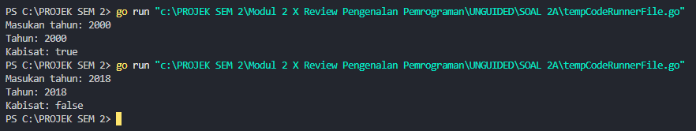

<h1 align="center">Laporan Praktikum Modul 2 <br>Review Pengenalan Pemrograman</h1>

<p align="center">Muhammad Haidar Amanullah- 103112400262</p>
## DASAR TEORI

Bahasa pemrograman Go dikenal memiliki struktur yang sederhana namun sangat bertenaga, dengan aturan sintaksis yang jelas dan efisien. Setiap aplikasi Go diawali dengan package main, sementara eksekusi dimulai dari fungsi utama, yaitu func main(). Proses pembuatan program melibatkan penulisan kode dalam file berekstensi .go, kemudian dikompilasi menggunakan perintah go build, dan dijalankan melalui terminal. Go mendukung berbagai tipe data dasar, seperti integer, float, boolean, dan string, serta memungkinkan deklarasi variabel secara fleksibel. Selain itu, bahasa Go juga memiliki kontrol alur program, termasuk perulangan for dalam berbagai variasi, serta percabangan melalui struktur if-else maupun switch-case untuk pengambilan keputusan.

## Unguided

### Soal Latihan 2A

#### Soal 1

>Telusuri program berikut dengan cara mengkompilasi dan mengeksekusi program. Silakan masukan data yang sesuai sebanyak yang diminta program. Perhatikan keluaran yang diperoleh. Coba terangkan apa sebenarnya yang dilakukan program tersebut?


```go
package main

import "fmt"

func main() {

    var (
        satu, dua, tiga string
        temp string
    )

    fmt.Print("Masukan input string: ")
    fmt.Scanln(&satu)

    fmt.Print("Masukan input string: ")
    fmt.Scanln(&dua)
    
    fmt.Print("Masukan input string: ")
    fmt.Scanln(&tiga)
    
    fmt.Println("Output awal = " + satu + " " + dua + " " + tiga)
    
    temp = satu
    satu = dua
    dua = tiga
    tiga = temp
    
    fmt.Println("Output akhir = " + satu + " " + dua + " " + tiga)
    
}
```


Kode di atas adalah program yang akan meminta tiga kata sebagai input dari pengguna, kemudian menyimpan input tersebut dan menampilkannya kembali. Hasil keluaran (output) yang akan ditampilkan berupa tiga kata yang diinputkan tadi, ditata dalam urutan tertentu sesuai dengan urutan input. Saat kita memasukkan input ke dalam program, hasil akhirnya adalah urutan kata yang telah bergeser (contoh: kata pertama menjadi kedua, kedua menjadi ketiga, dan ketiga menjadi pertama). Kuncinya terletak pada perubahan nilai variabel seperti berikut:
```go
temp = satu
satu = dua
dua = tiga
tiga = temp
```
Program ini melibatkan 4 variabel, dimana semua variabel tersebut bertipe data string. Variabel-variabel ini digunakan untuk menyimpan input dari pengguna.

#### Soal 2

>Tahun kabisat adalah tahun yang habis dibagi 400 atau habis dibagi 4 tetapi tidak habis dibagi 100. Buatlah sebuah program yang menerima input sebuah bilangan bulat dan memeriksa apakah bilangan tersebut merupakan tahun kabisat (true) atau bukan (false).

```go
package main

import "fmt"

func main() {

    var tahun int
    var kabisat bool

    fmt.Print("Masukan tahun: ")
    fmt.Scanln(&tahun)

    if tahun%400 == 0 || tahun%4 == 0 && tahun%100 != 0 {
        kabisat = true
    } else {
        kabisat = false
    }
  
    fmt.Println("Tahun:", tahun)
    fmt.Println("Kabisat:", kabisat)

}
```


Program ini dibuat untuk memeriksa apakah sebuah tahun termasuk tahun kabisat atau bukan. Tahun kabisat adalah tahun yang memenuhi salah satu dari dua syarat berikut:
- Tahun tersebut habis dibagi 400 (tahun%400 == 0), atau
- Tahun tersebut habis dibagi 4 (tahun%4 == 0), tetapi tidak habis dibagi 100 (tahun%100 != 0)

Ketika program dijalankan, pengguna diminta untuk memasukkan sebuah tahun sebagai input. Selanjutnya, program akan mengevaluasi tahun yang dimasukkan, memeriksa apakah tahun tersebut memenuhi salah satu dari syarat tahun kabisat yang telah disebutkan. Jika salah satu kondisi terpenuhi, maka hasil keluaran berupa nilai true yang menandakan bahwa tahun tersebut adalah tahun kabisat. Berikut adalah percabangan yang digunakan untuk menentukan apakah tahun tersebut kabisat atau bukan:

```go
if tahun%400 == 0 || tahun%4 == 0 && tahun%100 != 0 {
	kabisat = true
} else {
	kabisat = false
}
```
Dalam program ini, terdapat dua variabel utama:
- tahun (tipe data int) yang menyimpan nilai tahun yang diinputkan pengguna dan diproses oleh program.
- kabisat (tipe data bool) yang menyimpan nilai true atau false untuk menunjukkan apakah tahun tersebut kabisat atau bukan.

#### Soal 3

>Buat program Bola yang menerima input jari-jari suatu bola (bilangan bulat). Tampilkan Volume dan Luas kulit bola. 𝑣𝑜𝑙𝑢𝑚𝑒𝑏𝑜𝑙𝑎 = 4 3 𝜋𝑟 3 dan 𝑙𝑢𝑎𝑠𝑏𝑜𝑙𝑎 = 4𝜋𝑟 2 (π ≈ 3.1415926535).

```go
package main

import "fmt"

func main() {

    var jariJari int
    var volume, luas, phi float64

    fmt.Print("Masukan jari-jari: ")
    fmt.Scanln(&jariJari)

    phi = 3.1415926535

    volume = 4.0 / 3.0 * phi * float64(jariJari) * float64(jariJari) * float64(jariJari)
    luas = 4.0 * phi * float64(jariJari) * float64(jariJari)

    fmt.Println("Jejari =", jariJari)
    fmt.Printf("Bola dengan jejari %d memiliki volume %.4f dan luas kulit %.4f\n", jariJari, volume, luas)

}
```


Ketika program ini dijalankan, pengguna akan diminta untuk memasukkan nilai jari-jari bola. Nilai jari-jari tersebut kemudian dikonversi menjadi tipe data float64 agar program dapat melakukan perhitungan dengan benar. Setelah proses perhitungan selesai, hasil dari volume dan luas permukaan bola akan ditampilkan, dengan format empat angka di belakang koma.

Kode perhitungan volume dan luas permukaan bola dituliskan sebagai berikut:
```go
phi = 3.1415926535
volume = 4.0 / 3.0 * phi * float64(jariJari) * float64(jariJari) * float64(jariJari)
luas = 4.0 * phi * float64(jariJari) * float64(jariJari)
```
Program ini menggunakan tiga variabel utama, yaitu:
- jariJari (bertipe int) yang berfungsi untuk menyimpan input nilai jari-jari dari pengguna.
- phi (bertipe float64) digunakan sebagai nilai tetap untuk konstanta phi (π) sesuai dengan soal.
- volume dan luas (keduanya bertipe float64) yang akan menyimpan hasil perhitungan volume dan luas permukaan bola.

#### Soal 4

>Dibaca nilai temperatur dalam derajat Celsius. Nyatakan temperatur tersebut dalam Fahrenheit 𝐶𝑒𝑙𝑠𝑖𝑢𝑠 = (𝐹𝑎ℎ𝑟𝑒𝑛ℎ𝑒𝑖𝑡 − 32) × 5/9 𝑅𝑒𝑎𝑚𝑢𝑟 = 𝐶𝑒𝑙𝑐𝑖𝑢𝑠 × 4/5 𝐾𝑒𝑙𝑣𝑖𝑛 = (𝐹𝑎ℎ𝑟𝑒𝑛ℎ𝑒𝑖𝑡 + 459.67) × 5/9

```go
package main

import "fmt"

func main() {

    var celcius, reamur, fahrenheit int
    var kelvin float32

    fmt.Print("Temperatur Celcius: ")
    fmt.Scanln(&celcius)

    reamur = celcius * 4 / 5

    fahrenheit = celcius*9/5 + 32
    kelvin = (float32(fahrenheit) + 459.67) * 5 / 9

    fmt.Println("Derajat Reamur:", reamur)
    fmt.Println("Derajat Fahrenheit:", fahrenheit)
    fmt.Println("Derajat Kelvin:", int(kelvin))

}
```


Saat program dijalankan, pengguna akan diminta untuk memasukkan nilai suhu dalam satuan Celsius. Setelah itu, program akan menghitung dan mengonversi nilai suhu tersebut ke dalam beberapa satuan suhu lainnya, yaitu Fahrenheit, Reamur, dan Kelvin. Rumus perhitungan untuk setiap konversi disimpan dalam variabel-variabel berikut:
```go
reamur = celcius * 4 / 5
fahrenheit = celcius*9/5 + 32
kelvin = (float32(fahrenheit) + 459.67) * 5 / 9
```

#### Soal 5

>Tipe karakter sebenarnya hanya apa yang tampak dalam tampilan. Di dalamnya tersimpan dalam bentuk biner 8 bit (byte) atau 32 bit (rune) saja. Buat program ASCII yang akan membaca 5 buat data integer dan mencetaknya dalam format karakter. Kemudian membaca 3 buah data karakter dan mencetak 3 buah karakter setelah karakter tersebut (menurut tabel ASCII) Masukan terdiri dari dua baris. Baris pertama berisi 5 buah data integer. Data integer mempunyai nilai antara 32 s.d. 127. Baris kedua berisi 3 buah karakter yang berdampingan satu dengan yang lain (tanpa dipisahkan spasi). Keluaran juga terdiri dari dua baris. Baris pertama berisi 5 buah representasi karakter dari data yang diberikan, yang berdampingan satu dengan lain, tanpa dipisahkan spasi. Baris kedua berisi 3 buah karakter (juga tidak dipisahkan oleh spasi).

```go
package main

import "fmt"

func main() {

    var kode1, kode2, kode3, kode4, kode5 int
    var huruf1, huruf2, huruf3 rune

    fmt.Scan(&kode1, &kode2, &kode3, &kode4, &kode5)
    fmt.Scanln()
    fmt.Scanf("%c%c%c\n", &huruf1, &huruf2, &huruf3)

    huruf1 += 1
    huruf2 += 1
    huruf3 += 1

    fmt.Printf("%c%c%c%c%c\n", kode1, kode2, kode3, kode4, kode5)
    fmt.Printf("%c%c%c\n", huruf1, huruf2, huruf3)
}
```


Program ini berfungsi untuk membaca 5 kode ASCII yang berbeda. Kelima kode tersebut kemudian dikonversi menjadi huruf dan digabungkan menjadi sebuah kata. Selain itu, program ini juga memungkinkan untuk melakukan pergeseran karakter. Misalnya, jika kita ingin menggeser setiap huruf dari kata SNO, maka ketika program dijalankan, huruf S akan berubah menjadi T (karakter setelah S), N menjadi O, dan O menjadi P. Setiap karakter bergeser satu langkah ke depan dalam urutan abjad. Kunci dari program ini terletak pada penggunaan tipe data rune, yang berfungsi untuk menyimpan masing-masing karakter secara individual.

### Soal Latihan 2B

#### Soal 1

>Siswa kelas IPA di salah satu sekolah menengah atas di Indonesia sedang mengadakan praktikum kimia. Di setiap percobaan akan menggunakan 4 tabung reaksi, yang mana susunan warna cairan di setiap tabung akan menentukan hasil percobaan. Siswa diminta untuk mencatat hasil percobaan tersebut. Percobaan dikatakan berhasil apabila susunan warna zat cair pada gelas 1 hingga gelas 4 secara berturutan adalah ‘merah’, ‘kuning’, ‘hijau’, dan ‘ungu’ selama 5 kali percobaan berulang. Buatlah sebuah program yang menerima input berupa warna dari ke 4 gelas reaksi sebanyak 5 kali percobaan. Kemudian program akan menampilkan true apabila urutan warna sesuai dengan informasi yang diberikan pada paragraf sebelumnya, dan false untuk urutan warna lainnya.

```go
package main

import "fmt"

func main() {

    var gelas1, gelas2, gelas3, gelas4 string
    var berhasil bool

    berhasil = true

    for i := 1; i <= 5; i++ {
        fmt.Print("Percobaan ", i, ": ")
        fmt.Scan(&gelas1, &gelas2, &gelas3, &gelas4)
        
        if !(gelas1 == "merah" && gelas2 == "kuning" && gelas3 == "hijau" && gelas4 == "ungu") {
            berhasil = false
        }
    }

    fmt.Print("Berhasil: ", berhasil)
    
}
```


Program ini digunakan untuk memeriksa keberhasilan suatu percobaan kimia berdasarkan urutan warna dalam empat gelas. Jika selama 5 kali percobaan berturut-turut urutan warna selalu mengikuti pola "merah, kuning, hijau, ungu", maka percobaan dinyatakan berhasil (true). Namun, jika ada satu saja percobaan yang tidak sesuai dengan urutan tersebut, maka hasil akhirnya akan dianggap gagal (false).

#### Soal 2

>Suatu pita (string) berisi kumpulan nama-nama bunga yang dipisahkan oleh spasi dan ‘– ‘, contoh pita diilustrasikan seperti berikut ini. Pita: mawar – melati – tulip – teratai – kamboja – anggrek Buatlah sebuah program yang menerima input sebuah bilangan bulat positif (dan tidak nol) N, kemudian program akan meminta input berupa nama bunga secara berulang sebanyak N kali dan nama tersebut disimpan ke dalam pita. (Petunjuk: gunakan operasi penggabungan string dengan operator “+” ). Tampilkan isi pita setelah proses input selesai.

```go
package main

import "fmt"  

func main() {

    var bunga, pita string
    var jumlah int

    jumlah = 0

    for {

        fmt.Print("Bunga ", jumlah+1, ": ")
        fmt.Scan(&bunga)

        if bunga == "selesai" {
            break
        }

        pita = pita + bunga + " - "
        jumlah++

    }  

    fmt.Println("Pita:", pita)
    fmt.Println("Bunga:", jumlah)

}
```


Program ini dibuat untuk mengumpulkan nama-nama bunga yang dimasukkan oleh pengguna ke dalam sebuah string, di mana setiap nama bunga dipisahkan oleh tanda "-". Pengguna dapat terus memasukkan nama bunga satu per satu, hingga mengetikkan "selesai" sebagai tanda berhenti. Selain itu, program juga akan menghitung jumlah bunga yang berhasil dimasukkan.

#### Soal 3

>Setiap hari Pak Andi membawa banyak barang belanjaan dari pasar dengan mengendarai sepeda motor. Barang belanjaan tersebut dibawa dalam kantong terpal di kiri-kanan motor. Sepeda motor tidak akan oleng jika selisih berat barang di kedua kantong sisi tidak lebih dari 9 kg. Buatlah program Pak Andi yang menerima input dua buah bilangan real positif yang menyatakan berat total masing-masing isi kantong terpal. Program akan terus meminta input bilangan tersebut hingga salah satu kantong terpal berisi 9 kg atau lebih.

```go
package main

import "fmt"

func main() {

    var kantong1, kantong2, selisih float32
    var oleng bool

    for {
        fmt.Print("Masukan berat belanjaan di kedua kantong: ")
        fmt.Scan(&kantong1, &kantong2)

        if kantong1 < 0 || kantong2 < 0 {
            fmt.Println("Proses selesai")
            break
        }

        if kantong1+kantong2 > 150 {
            fmt.Println("Proses selesai")
            break
        }

        if kantong1 > kantong2 {
            selisih = kantong1 - kantong2
        } else {
            selisih = kantong2 - kantong1
        }

        oleng = selisih >= 9
        fmt.Println("Sepeda motor pak Andi akan oleng:", oleng)
    }
}
```


Program ini berfungsi untuk memeriksa apakah sepeda motor Pak Andi seimbang saat membawa belanjaan di dua kantong. Sepeda motor dinyatakan oleng apabila perbedaan berat antara kantong kiri dan kanan mencapai 9 kg atau lebih. Selain itu, program akan berhenti jika salah satu dari kantong memiliki berat negatif atau jika total berat dari kedua kantong melebihi 150 kg.

#### Soal 4

>Setiap hari Pak Andi membawa banyak barang belanjaan dari pasar dengan mengendarai sepeda motor. Barang belanjaan tersebut dibawa dalam kantong terpal di kiri-kanan motor. Sepeda motor tidak akan oleng jika selisih berat barang di kedua kantong sisi tidak lebih dari 9 kg. Buatlah program Pak Andi yang menerima input dua buah bilangan real positif yang menyatakan berat total masing-masing isi kantong terpal. Program akan terus meminta input bilangan tersebut hingga salah satu kantong terpal berisi 9 kg atau lebih.

```go
package main

import (
    "fmt"
    "math"
)

func main() {
    var k int

    fmt.Print("Nilai K: ")
    fmt.Scan(&k)

    result := 1.0

    for i := 0; i < k; i++ {
        numerator := math.Pow(float64(4*i+2), 2)
        denumerator := float64((4*i + 1) * (4*i + 3))
        result *= numerator / denumerator
    }

    fmt.Printf("Hasil dari operasi fungsi = %.10f\n", result)
}
```


Program ini dirancang untuk menerima input berupa bilangan bulat K dari pengguna. Setelah itu, program akan menghitung nilai dari suatu fungsi dengan menggunakan perulangan. Hasil akhir perhitungan ditampilkan dengan presisi 10 angka di belakang koma.

### Latihan Soal 2C

#### Soal 1

>PT POS membutuhkan aplikasi perhitungan biaya kirim berdasarkan berat parsel. Maka, buatlah program BiayaPos untuk menghitung biaya pengiriman tersebut dengan ketentuan sebagai berikut! Dari berat parsel (dalam gram), harus dihitung total berat dalam kg dan sisanya (dalam gram). Biaya jasa pengiriman adalah Rp. 10.000,- per kg. Jika sisa berat tidak kurang dari 500 gram, maka tambahan biaya kirim hanya Rp. 5,- per gram saja. Tetapi jika kurang dari 500 gram, maka tambahan biaya akan dibebankan sebesar Rp. 15,- per gram. Sisa berat (yang kurang dari 1kg) digratiskan biayanya apabila total berat ternyata lebih dari 10kg.

```go
package main

import "fmt"

func main() {  

    var berat, kg, gram, harga int

    fmt.Print("Berat parsel (gram): ")
    fmt.Scanln(&berat)

    kg = berat / 1000
    gram = berat % 1000

    fmt.Println("Detail berat:", kg, "kg", "+", gram, "gram")

    if gram >= 500 {
        gram = gram * 5
    } else {
        gram = gram * 15
    }

    if kg < 10 {
        kg = kg * 10000
        harga = kg + gram
    } else {
        kg = kg * 10000
        harga = kg
    }

    fmt.Println("Detail biaya: Rp", kg, "+ Rp", gram)
    fmt.Println("Total biaya: Rp", harga)

}
```


Program ini dibuat untuk menghitung biaya pengiriman parsel berdasarkan beratnya dalam satuan gram. Proses perhitungan dilakukan dengan langkah-langkah berikut:

1. Berat total diubah menjadi satuan kilogram dan gram.
2. Biaya per kilogram ditetapkan sebesar Rp 10.000.
3. Tambahan biaya untuk bagian gram dihitung berdasarkan aturan berikut:
    - Jika gram < 500, biaya tambahan adalah Rp 5 per gram. 
    - Jika gram >= 500, biaya tambahan adalah Rp 15 per gram.
4. Jika total berat mencapai 10 kg atau lebih, maka biaya tambahan untuk gram tidak dikenakan alias gratis.
5. Total biaya dihitung dengan menjumlahkan biaya per kg dan biaya tambahan gram (atau hanya biaya per kg jika berat >= 10 kg).

#### Soal 2

>Jawablah pertanyaan-pertanyaan berikut: 
> a. Jika nam diberikan adalah 80.1, apa keluaran dari program tersebut? Apakah eksekusi program tersebut sesuai spesifikasi soal? 
> b. Apa saja kesalahan dari program tersebut? Mengapa demikian? Jelaskan alur program seharusnya! 
> c. Perbaiki program tersebut! Ujilah dengan masukan: 93.5; 70.6; dan 49.5. Seharusnya keluaran yang diperoleh adalah ‘A’, ‘B’, dan ‘D’.

##### Kode Awal

```go
package main
import “fmt”
func main() {
 var nam float64
 var nmk string
 fmt.Print(“Nilai akhir mata kuliah: “)
 fmt.Scanln(&nam)
 if nam > 80 {
 nam = “A”
 }
 if nam > 72.5 {
 nam = “AB”
 }
 if nam > 65 {
 nam = “B”
 }
 if nam > 57.5 {
 nam = “BC”
 }
 if nam > 50 {
 nam = “C”
 }
 if nam > 40 {
 nam = “D”
 } else if nam <= 40 {
 nam = “E”
 }
 fmt.Println(“Nilai mata kuliah: “, nmk)
}
```

##### Kode Setelah Diperbaiki
```go
package main

import "fmt"  

func main() {

    var nam float64
    var nmk string

    fmt.Print("Nilai akhir mata kuliah: ")
    fmt.Scanln(&nam)

    if nam > 80 {
        nmk = "A"
    } else if nam > 72.5 && nam <= 80 {
        nmk = "AB"
    } else if nam > 65 && nam <= 72.5 {
        nmk = "B"
    } else if nam > 57.5 && nam <= 65 {
        nmk = "BC"
    } else if nam > 50 && nam <= 57.5 {
        nmk = "C"
    } else if nam > 40 && nam <= 50 {
        nmk = "D"
    } else if nam <= 40 {
        nmk = "E"
    }
  
    fmt.Println("Nilai mata kuliah:", nmk)
}
```


1. Saat program pertama kali dijalankan, output yang dihasilkan tidak sesuai dengan kriteria yang diharapkan. Hal ini disebabkan oleh adanya beberapa kesalahan pada kode program yang perlu diperbaiki.
2. Terdapat cukup banyak kesalahan pada program, di antaranya:
- Program menggunakan terlalu banyak percabangan tanpa memanfaatkan else if, sehingga alur eksekusi menjadi tumpang-tindih dan sulit dipahami.
- Variabel yang digunakan untuk menyimpan hasil output salah; seharusnya menggunakan variabel nmk bertipe data string, bukan nam yang bertipe float64.
- Tidak ada batasan nilai yang jelas pada percabangan. Rentang nilai untuk A, B, C, D, dan E tidak ditentukan, sehingga program tidak memiliki acuan yang jelas untuk memproses input.
- Penggunaan tanda petik dua (") pada kode juga kurang tepat dan harus disesuaikan.
1. Setelah program diperbaiki dan diuji ulang, hasil output yang ditampilkan sudah sesuai dengan yang diharapkan, sesuai dengan spesifikasi output yang ditentukan.

#### Soal 3

>Sebuah bilangan bulat b memiliki faktor bilangan f > 0 jika f habis membagi b. Contoh: 2 merupakan faktor dari bilangan 6 karena 6 habis dibagi 2. Buatlah program yang menerima input sebuah bilangan bulat b dan b > 1. Program harus dapat mencari dan menampilkan semua faktor dari bilangan tersebut!
> Bilangan bulat b > 0 merupakan bilangan prima p jika dan hanya jika memiliki persis dua faktor bilangan saja, yaitu 1 dan dirinya sendiri. Lanjutkan program sebelumnya. Setelah menerima masukan sebuah bilangan bulat b > 0. Program tersebut mencari dan menampilkan semua faktor bilangan tersebut. Kemudian, program menentukan apakah b merupakan bilangan prima.

```go
package main

import "fmt"

func main() {

    var bilangan, faktor int
    var prima bool

    fmt.Print("Bilangan: ")
    fmt.Scan(&bilangan)

    fmt.Print("Faktor: ")
    for i := 1; i <= bilangan; i++ {

        if bilangan%i == 0 {
            fmt.Print(i, " ")
            faktor++
        }

    }

    fmt.Println()

    if faktor == 2 {
        prima = true
    } else {
        prima = false
    }

    fmt.Println("Prima:", prima)
}
```


Program ini berfungsi untuk mencari dan menampilkan semua angka yang dapat membagi habis angka yang dimasukkan oleh pengguna. Ketika program dijalankan, pengguna diminta untuk memasukkan sebuah bilangan bulat. Setelah itu, program akan melakukan proses perulangan dari angka 1 hingga angka yang dimasukkan oleh pengguna. Dalam setiap iterasi, program akan memeriksa apakah angka tersebut dapat membagi habis bilangan input. Jika iya, maka angka tersebut akan dicetak sebagai salah satu faktor dari bilangan tersebut.

Berikut potongan kode perulangan yang digunakan dalam program:
```go
for i := 1; i <= bilangan; i++ {
	if bilangan%i == 0 {
		fmt.Print(i, " ")
		faktor++
	}
}
```
