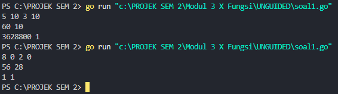
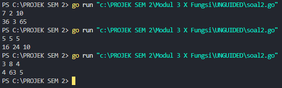
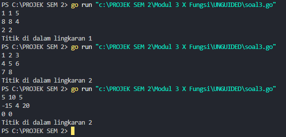

<h1 align="center">Laporan Praktikum Modul 3 <br>Fungsi</h1>
<p align="center">Muhammad Haidar Amanullah- 103112400262</p>

## Dasar Teori

Fungsi dalam pemrograman adalah bagian kode yang bisa menerima input, memprosesnya, dan mengembalikan hasil. Fungsi membantu membuat kode lebih rapi, mudah dipahami, dan bisa digunakan berulang kali. Dalam Go, fungsi ditulis dengan func, bisa punya parameter (input), dan harus mengembalikan nilai jika diperlukan pakai return. Syarat fungsi adalah:
1. Ada deklarasi tipe nilai yang akan dikembalikan
2. Terdapat kata kunci return dalam badan subprogram

## UNGUIDED

### Soal 1

>Minggu ini, mahasiswa Fakultas Informatika mendapatkan tugas dari mata kuliah matematika
diskrit untuk mempelajari kombinasi dan permutasi. Jonas salah seorang mahasiswa, iseng
untuk mengimplementasikannya ke dalam suatu program. Oleh karena itu bersediakah kalian
membantu Jonas? (tidak tentunya ya :p)

>Masukan terdiri dari empat buah bilangan asli 𝑎, 𝑏, 𝑐, dan 𝑑 yang dipisahkan oleh spasi,
dengan syarat 𝑎 ≥ 𝑐 dan 𝑏 ≥ 𝑑.

>Keluaran terdiri dari dua baris. Baris pertama adalah hasil permutasi dan kombinasi 𝒂
terhadap 𝑐, sedangkan baris kedua adalah hasil permutasi dan kombinasi 𝑏 terhadap 𝑑.

Catatan: permutasi (P) dan kombinasi (C) dari 𝑛 terhadap 𝑟 (𝑛 ≥ 𝑟) dapat dihitung dengan
menggunakan persamaan berikut!

```go
𝑃(𝑛, 𝑟) = 𝑛! / (𝑛−𝑟)!, sedangkan 𝐶(𝑛, 𝑟) = 𝑛! / 𝑟!(𝑛−𝑟)!
```
```go
package main

import "fmt"

func Faktorial(n int) int {
    var hasil int

    if n == 0 {
        return 1
    }

    hasil = 1
    for i := 1; i <= n; i++ {
        hasil *= i
    }

    return hasil
}

func Permutasi(n, r int) int {
    var hasil int
    hasil = Faktorial(n) / Faktorial(n-r)

    return hasil
}

func Kombinasi(n, r int) int {
    var hasil int
    hasil = Faktorial(n) / (Faktorial(r) * Faktorial(n-r))
    return hasil
}

func main() {
    var a, b, c, d int
    fmt.Scan(&a, &b, &c, &d)

    if a >= c && b >= d {
        fmt.Println(Permutasi(a, c), Kombinasi(a, c))
        fmt.Println(Permutasi(b, d), Kombinasi(b, d))
    }
}
```


Program ini digunakan untuk menghitung nilai faktorial, permutasi, dan kombinasi berdasarkan input yang diberikan oleh pengguna. Faktorial menjadi dasar perhitungan dalam program ini. Permutasi digunakan untuk menghitung banyaknya cara menyusun elemen dengan memperhatikan urutan, sedangkan kombinasi digunakan untuk menghitung banyaknya cara memilih elemen tanpa memperhatikan urutan.

Program meminta empat angka sebagai input, kemudian akan memproses apakah nilai-nilai tersebut sesuai dengan syarat perhitungan. Setelah itu, program akan menghitung nilai sesuai permintaan.

##### Fungsi Permutasi

```go
func Permutasi(n, r int) int {
	var hasil int
	hasil = Faktorial(n) / Faktorial(n-r)

	return hasil
}
```
Rumus yang digunakan untuk menghitung permutasi adalah sebagai berikut:
```go
P(n, r) = n! / (n−r)!

```
##### Fungsi Kombinasi
```go
func Kombinasi(n, r int) int {
	var hasil int
	hasil = Faktorial(n) / (Faktorial(r) * Faktorial(n-r))
	return hasil
}
```
Perhitungan kombinasi mengikuti rumus berikut:
```go
C(n, r) = n! / (r!(n−r)!)
```

### Soal 2

>Diberikan tiga buah fungsi matematika yaitu 𝑓 (𝑥) = 𝑥 2 , 𝑔 (𝑥) = 𝑥 − 2 dan ℎ (𝑥) = 𝑥 + 1. Fungsi komposisi (𝑓𝑜𝑔𝑜ℎ)(𝑥) artinya adalah 𝑓(𝑔(ℎ(𝑥))). Tuliskan 𝑓(𝑥), 𝑔(𝑥) dan ℎ(𝑥) dalam bentuk function. Masukan terdiri dari sebuah bilangan bulat 𝑎, 𝑏 dan 𝑐 yang dipisahkan oleh spasi. Keluaran terdiri dari tiga baris. Baris pertama adalah (𝑓𝑜𝑔𝑜ℎ)(𝑎), baris kedua (𝑔𝑜ℎ𝑜𝑓)(𝑏), dan baris ketiga adalah (ℎ𝑜𝑓𝑜𝑔)(𝑐)!

```go
package main

import "fmt"

func f(x int) int {
    var rumus int
    rumus = x * x
    return rumus
}

func g(x int) int {
    var rumus int
    rumus = x - 2
    return rumus
}

func h(x int) int {
    var rumus int
    rumus = x + 1
    return rumus
}

func main() {

    var x1, x2, x3, fogoh, gohof, hofog int
    fmt.Scan(&x1, &x2, &x3)
    
    fogoh = f(g(h(x1)))
    gohof = g(h(f(x2)))
    hofog = h(f(g(x3)))
    
    fmt.Println(fogoh, gohof, hofog)
    
}
```


Ketika program dijalankan, program akan meminta pengguna untuk memasukkan tiga buah nilai input. Ketiga nilai ini kemudian diproses dengan tiga kombinasi fungsi berbeda, dan menghasilkan tiga nilai output sebagai berikut:
1. Hasil dari perhitungan dengan rumus **f(g(h(x1)))**
2. Hasil dari perhitungan dengan rumus **g(h(f(x2)))**
3. Hasil dari perhitungan dengan rumus **h(f(g(x3)))**

##### Fungsi-fungsi yang digunakan:

**Fungsi f:**
```go
func f(x int) int {
	var rumus int
	rumus = x * x
	return rumus
}
```
Dengan rumus:
```go
𝑓(𝑥) = 𝑥^2
```
**Fungsi g:**
```go
func g(x int) int {
	var rumus int
	rumus = x - 2
	return rumus
}
```
Dengan rumus:
```go
𝑔(𝑥) = 𝑥 − 2
```
**Fungsi h:**
```go
func h(x int) int {
	var rumus int
	rumus = x + 1
	return rumus
}
```
Dengan rumus:
```go
h(𝑥) = 𝑥 + 1
```
##### Kombinasi pengolahan nilai:

Nilai-nilai input akan diolah dengan cara berikut:
```go
fogoh = f(g(h(x1)))   // f(g(h(x1)))
gohof = g(h(f(x2)))   // g(h(f(x2)))
hofog = h(f(g(x3)))   // h(f(g(x3)))

```
Atau dalam notasi matematika:
```go
(f∘g∘h)(a), (g∘h∘f)(b), (h∘f∘g)(c)
```

### Soal 3

>Suatu lingkaran didefinisikan dengan koordinat titik pusat (𝑐𝑥, 𝑐𝑦) dengan radius 𝑟. Apabila diberikan dua buah lingkaran, maka tentukan posisi sebuah titik sembarang (𝑥, 𝑦) berdasarkan dua lingkaran tersebut. Masukan terdiri dari beberapa tiga baris. Baris pertama dan kedua adalah koordinat titik pusat dan radius dari lingkaran 1 dan lingkaran 2, sedangkan baris ketiga adalah koordinat titik sembarang. Asumsi sumbu x dan y dari semua titik dan juga radius direpresentasikan dengan bilangan bulat. Keluaran berupa string yang menyatakan posisi titik "Titik di dalam lingkaran 1 dan 2", "Titik di dalam lingkaran 1", "Titik di dalam lingkaran 2", atau "Titik di luar lingkaran 1 dan 2".

```go
package main

import (
    "fmt"
    "math"
)

func jarak(a, b, c, d float64) float64 {
    return math.Sqrt(math.Pow(a-c, 2) + math.Pow(b-d, 2))
}

func didalam(cx, cy, r, x, y float64) bool {
    return jarak(cx, cy, x, y) <= r
}
func main() {
    var cx1, cy1, r1, cx2, cy2, r2, x, y float64
    var didalam1, didalam2 bool

    fmt.Scan(&cx1, &cy1, &r1)
    fmt.Scan(&cx2, &cy2, &r2)
    fmt.Scan(&x, &y)

      didalam1 = didalam(cx1, cy1, r1, x, y)
    didalam2 = didalam(cx2, cy2, r2, x, y)

    if didalam1 && didalam2 {
        fmt.Println("Titik di dalam lingkaran 1 dan 2")
    } else if didalam1 {
        fmt.Println("Titik di dalam lingkaran 1")
    } else if didalam2 {
        fmt.Println("Titik di dalam lingkaran 2")
    } else {
        fmt.Println("Titik di luar lingkaran 1 dan 2")
    }
}
```


Program ini digunakan untuk menentukan apakah suatu titik berada di dalam satu, dua, atau di luar lingkaran berdasarkan input pengguna. Program menerima masukan berupa koordinat pusat dan jari-jari dari dua buah lingkaran, serta koordinat titik yang ingin diuji. Program kemudian menghitung jarak antara titik tersebut dengan pusat lingkaran menggunakan rumus Euclidean, lalu mengevaluasi apakah titik tersebut termasuk ke dalam lingkaran atau tidak. Hasil akhir program akan menampilkan keterangan posisi titik, apakah berada di dalam satu lingkaran saja, kedua lingkaran, atau tidak berada di dalam keduanya.

##### Fungsi didalam
```go
func didalam(cx, cy, r, x, y float64) bool {
	return jarak(cx, cy, x, y) <= r
}
```
Fungsi didalam bertugas untuk memeriksa apakah suatu titik (x, y) berada di dalam sebuah lingkaran dengan pusat (cx, cy) dan jari-jari r. Fungsi ini akan memanggil fungsi jarak untuk menghitung jarak antara titik dengan pusat lingkaran. Jika jaraknya sama dengan atau lebih kecil dari jari-jari lingkaran, maka titik dianggap berada di dalam lingkaran, dan fungsi akan mengembalikan nilai true. Sebaliknya, jika jarak lebih besar dari jari-jari, maka fungsi akan mengembalikan false.

##### Fungsi jarak
```go
func jarak(a, b, c, d float64) float64 {
	return math.Sqrt(math.Pow(a-c, 2) + math.Pow(b-d, 2))
}
```
Fungsi jarak digunakan untuk menghitung jarak antara dua titik, yaitu (a, b) dan (c, d), menggunakan rumus Euclidean.