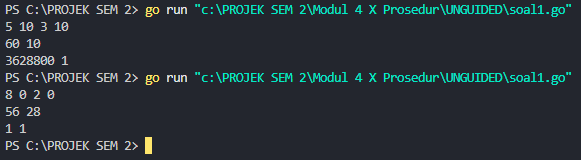
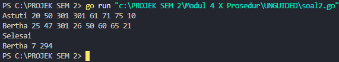
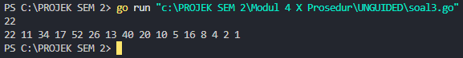

<h1 align="center">Laporan Praktikum Modul 4 <br>Prosedur</h1>
<p align="center">MUHAMMAD HAIDAR AMANULLAH - 103112400262 </p>

## Dasar Teori
Prosedur adalah sebuah fungsi yang digunakan untuk menjalankan sekumpulan perintah tanpa mengembalikan nilai. Penggunaan prosedur di bahasa go hampir sama dengan penggunaan fungsi. Yang dimana dibedakan dengan tidak ada tipe data yang digunakan untuk mengembalikan nilai. Namun prosedur juga bisa membaca alamat memori, yaitu disebut dengan Pass by Reference. 

## Unguided

### Soal 1
> Minggu ini, mahasiswa Fakultas Informatika mendapatkan tugas dari mata kuliah matematika diskrit untuk mempelajari kombinasi dan permutasi. Jonas salah seorang mahasiswa, iseng untuk mengimplementasikannya ke dalam suatu program. Oleh karena itu bersediakah kalian membantu Jonas? (tidak tentunya ya :p) Masukan terdiri dari empat buah bilangan asli 𝑎, 𝑏, 𝑐, dan 𝑑 yang dipisahkan oleh spasi, dengan syarat 𝑎 ≥ 𝑐 dan 𝑏 ≥ 𝑑. Keluaran terdiri dari dua baris. Baris pertama adalah hasil permutasi dan kombinasi 𝒂 terhadap 𝑐, sedangkan baris kedua adalah hasil permutasi dan kombinasi 𝑏 terhadap 𝑑. Catatan: permutasi (P) dan kombinasi (C) dari 𝑛 terhadap 𝑟 (𝑛 ≥ 𝑟) dapat dihitung dengan menggunakan persamaan berikut! 𝑃(𝑛, 𝑟) = 𝑛! (𝑛−𝑟)! , sedangkan 𝐶(𝑛, 𝑟) = 𝑛! 𝑟!(𝑛−𝑟)!

```go
package main

import "fmt"

func factorial(n int, hasil *int) {
    *hasil = 1
    for i := 1; i <= n; i++ {
        *hasil *= i
    }
}

func permutation(n, r int, hasil *int) {
    var faktorialN, faktorialNR int

    factorial(n, &faktorialN)
    factorial(n-r, &faktorialNR)
    *hasil = faktorialN / faktorialNR
}

func combination(n, r int, hasil *int) {
    var faktorialN, faktorialR, faktorialNR int

    factorial(n, &faktorialN)
    factorial(r, &faktorialR)
    factorial(n-r, &faktorialNR)
    *hasil = faktorialN / (faktorialR * faktorialNR)
}

func main() {
    var a, b, c, d, permutationA, permutationB, combinationA, combinationB int
    fmt.Scan(&a, &b, &c, &d)

    if a >= c && b >= d {
        permutation(a, c, &permutationA)
        combination(a, c, &combinationA)
        permutation(b, d, &permutationB)
        combination(b, d, &combinationB)
        fmt.Println(permutationA, combinationA)
        fmt.Println(permutationB, combinationB)
    } else {
        fmt.Print("Input tidak valid")
    }

}
```


#### Penjelasan Program

Program ini digunakan untuk menghitung nilai permutasi dan kombinasi berdasarkan empat bilangan asli yang diinput oleh pengguna. Empat bilangan tersebut disimpan pada variabel a, b, c, dan d. Program memiliki beberapa aturan:
- Nilai a harus lebih besar atau sama dengan c (a ≥ c)
- Nilai b harus lebih besar atau sama dengan d (b ≥ d)
Setelah input diterima, program akan menghitung:
- Permutasi dan kombinasi a terhadap c
- Permutasi dan kombinasi b terhadap d
Program ini menggunakan tiga prosedur utama: factorial, permutation, dan combination.
##### a. Prosedur factorial

```go
func factorial(n int, hasil *int) {
	*hasil = 1
	for i := 1; i <= n; i++ {
		*hasil *= i
	}
}
```

Prosedur ini menghitung nilai faktorial dari bilangan n. Faktorial adalah perkalian dari semua bilangan bulat positif dari 1 hingga n. Contoh perhitungan faktorial jika n = 5:

```
1 × 1 = 1
1 × 2 = 2
2 × 3 = 6
6 × 4 = 24
24 × 5 = 120
```

Pada prosedur ini:
- Nilai awal hasil diinisialisasi ke 1 untuk mencegah nilai menjadi 0.
- Perulangan for dilakukan dari 1 hingga n. 
- Hasil akhir disimpan di variabel hasil menggunakan pointer hasil.
##### b. Prosedur permutation

```go
func permutation(n, r int, hasil *int) {
	var faktorialN, faktorialNR int
	
	factorial(n, &faktorialN)
	factorial(n-r, &faktorialNR)

	*hasil = faktorialN / faktorialNR
}
```

Prosedur ini menghitung nilai permutasi dengan rumus:

P(n,r)=n!(n−r)!P(n, r) = \frac{n!}{(n - r)!}P(n,r)=(n−r)!n!​

Permutasi digunakan untuk menghitung banyaknya cara menyusun  objek dari n objek, dengan memperhatikan urutan. Prosedur ini memanggil factorial untuk menghitung nilai faktorial n dan n-r, kemudian membaginya sesuai rumus.
##### c. Prosedur combination

```go
func combination(n, r int, hasil *int) {
	var faktorialN, faktorialR, faktorialNR int

	factorial(n, &faktorialN)
	factorial(r, &faktorialR)
	factorial(n-r, &faktorialNR)

	*hasil = faktorialN / (faktorialR * faktorialNR)
}
```

Prosedur ini menghitung nilai kombinasi dengan rumus:

C(n,r)=n!r!(n−r)!C(n, r) = \frac{n!}{r!(n - r)!}C(n,r)=r!(n−r)!n!​

Kombinasi digunakan untuk menghitung banyaknya cara memilih r objek dari n objek, tanpa memperhatikan urutan. Seperti permutasi, prosedur ini memanfaatkan prosedur factorial untuk menghitung faktorial yang dibutuhkan.

### Soal 2

>Kompetisi pemrograman tingkat nasional berlangsung ketat. Setiap peserta diberikan 8 soal yang harus dapat diselesaikan dalam waktu 5 jam saja. Peserta yang berhasil menyelesaikan soal paling banyak dalam waktu paling singkat adalah pemenangnya. Buat program gema yang mencari pemenang dari daftar peserta yang diberikan. Program harus dibuat modular, yaitu dengan membuat prosedur hitungSkor yang mengembalikan total soal dan total skor yang dikerjakan oleh seorang peserta, melalui parameter formal. Pembacaan nama peserta dilakukan di program utama, sedangkan waktu pengerjaan dibaca di dalam prosedur. prosedure hitungSkor(in/out soal, skor : integer) Setiap baris masukan dimulai dengan satu string nama peserta tersebut diikuti dengan adalah 8 integer yang menyatakan berapa lama (dalam menit) peserta tersebut menyelesaikan soal. Jika tidak berhasil atau tidak mengirimkan jawaban maka otomatis dianggap menyelesaikan dalam waktu 5 jam 1 menit (301 menit). Satu baris keluaran berisi nama pemenang, jumlah soal yang diselesaikan, dan nilai yang diperoleh. Nilai adalah total waktu yang dibutuhkan untuk menyelesaikan soal yang berhasil diselesaikan.

```go
package main

import "fmt"

func hitungSkor(soal, skor *int) {
    var time int

    *soal = 0
    *skor = 0

    for i := 0; i < 8; i++ {
        fmt.Scan(&time)
        if time < 301 {
            *soal++
            *skor += time
        }
    }
}

func main() {

    var nama, pemenang string
    var soal, skor, maksimumSoal, minimumSkor int

    maksimumSoal = -1
    minimumSkor = 99999

    for {
        fmt.Scan(&nama)

        if nama == "Selesai" || nama == "selesai" {
            break
        }

        hitungSkor(&soal, &skor)
        
        if soal > maksimumSoal || (soal == maksimumSoal && skor < minimumSkor) {
            maksimumSoal = soal
            minimumSkor = skor
            pemenang = nama
        }
    }
    
    fmt.Println(pemenang, maksimumSoal, minimumSkor)
}
```



#### Penjelasan

Program ini akan menentukan pemenang dari sebuah kompetisi pemrograman berdasarkan jumlah soal yang berhasil diselesaikan dan total waktu pengerjaan. Program akan melakukan perulangan sebanyak 8 kali (sesuai jumlah soal), dengan batas waktu pengerjaan setiap soal adalah 5 jam (300 menit). Jika waktu pengerjaan melebihi 300 menit, soal dianggap tidak berhasil diselesaikan.
##### a. Prosedur hitungSkor

```go
func hitungSkor(soal, skor *int) {
	var time int

	*soal = 0
	*skor = 0

	for i := 0; i < 8; i++ {
		fmt.Scan(&time)
		if time < 301 {
			*soal++
			*skor += time
		}
	}
}
```

Prosedur ini digunakan untuk menghitung jumlah soal yang berhasil dikerjakan dan total waktu pengerjaan peserta. Perulangan dilakukan sebanyak 8 kali untuk menerima input waktu pengerjaan soal. Jika waktu yang dimasukkan kurang dari 301 menit, maka jumlah soal bertambah satu dan total waktu diperbarui.
##### b. Fungsi main

```go
func main() {
	var nama, pemenang string
	var soal, skor, maksimumSoal, minimumSkor int

	maksimumSoal = -1
	minimumSkor = 99999

	for {
		fmt.Scan(&nama)

		if nama == "Selesai" || nama == "selesai" {
			break
		}

		hitungSkor(&soal, &skor)

		if soal > maksimumSoal || (soal == maksimumSoal && skor < minimumSkor) {
			maksimumSoal = soal
			minimumSkor = skor
			pemenang = nama
		}
	}

	fmt.Println(pemenang, maksimumSoal, minimumSkor)
}
```

Fungsi main mengatur jalannya program. Program akan meminta input nama peserta secara berulang hingga peserta memasukkan kata kunci "Selesai" atau "selesai". Setiap peserta akan dihitung jumlah soal yang berhasil dikerjakan dan total waktu pengerjaannya menggunakan prosedur hitungSkor. Jika peserta memiliki jumlah soal lebih banyak, atau jumlah soal sama dengan peserta sebelumnya tetapi waktu pengerjaan lebih kecil, maka data pemenang diperbarui. Setelah semua peserta diproses, program mencetak nama pemenang, jumlah soal yang berhasil diselesaikan, dan total waktu pengerjaan terbaik.

### Soal 3

>Skiena dan Revilla dalam Programming Challenges mendefinisikan sebuah deret bilangan. Deret dimulai dengan sebuah bilangan bulat n. Jika bilangan n saat itu genap, maka suku berikutnya adalah ½n, tetapi jika ganjil maka suku berikutnya bernilai 3n+1. Rumus yang sama digunakan terus menerus untuk mencari suku berikutnya. Deret berakhir ketika suku terakhir Halaman 9 | M o d u l P r a k t i k u m A l g o r i t m a P e m r o g r a m a n bernilai 1. Sebagai contoh jika dimulai dengan n=22, maka deret bilangan yang diperoleh adalah: 22 11 34 17 52 26 13 40 20 10 5 16 8 4 2 1 Untuk suku awal sampai dengan 1000000, diketahui deret selalu mencapai suku dengan nilai 1. Buat program skiena yang akan mencetak setiap suku dari deret yang dijelaskan di atas untuk nilai suku awal yang diberikan. Pencetakan deret harus dibuat dalam prosedur cetakDeret yang mempunyai 1 parameter formal, yaitu nilai dari suku awal. prosedure cetakDeret(in n : integer ) Masukan berupa satu bilangan integer positif yang lebih kecil dari 1000000. Keluaran terdiri dari satu baris saja. Setiap suku dari deret tersebut dicetak dalam baris yang dan dipisahkan oleh sebuah spasi.

```go
package main

import "fmt"

func cetakDeret(n int) {
    for {
        fmt.Print(n, " ")
        if n == 1 {
            break
        }

        if n%2 == 0 {
            n /= 2
        } else {
            n = n*3 + 1
        }
    }
}

func main() {

    var n int
    fmt.Scan(&n)

    if n > 0 && n < 1000 {
        cetakDeret(n)
    }

}
```



#### Penjelasan

Program ini digunakan untuk mencetak deret angka berdasarkan aturan berikut:
- Jika nilai n adalah bilangan genap, maka n dibagi 2 (n = n / 2).
- Jika nilai n adalah bilangan ganjil, maka n dihitung dengan rumus 3n + 1.
Program diawali dengan membaca sebuah bilangan bulat positif n dari input, dengan batasan 1 hingga 999. Jika input valid, maka prosedur cetakDeret akan dipanggil untuk mencetak deret angkanya. Deret dimulai dari nilai n hingga mencapai angka 1.

##### a. Prosedur cetakDeret
```go
func cetakDeret(n int) {
	for {
		fmt.Print(n, " ")
		if n == 1 {
			break
		}

		if n%2 == 0 {
			n /= 2
		} else {
			n = n*3 + 1
		}
	}
}
```

Prosedur cetakDeret digunakan untuk mencetak deret angka. Prosedur ini menerima satu parameter n (bilangan bulat positif) sebagai titik awal deret.

Di dalam prosedur, terdapat perulangan for tanpa kondisi sehingga perulangan akan terus berjalan hingga n mencapai nilai 1. Setiap iterasi, nilai n dicetak diikuti spasi. Jika n sudah bernilai 1, perulangan dihentikan dengan break.

Selanjutnya:
- Jika n adalah bilangan genap (n % 2 == 0), maka n dibagi 2.
- Jika n adalah bilangan ganjil, maka n dihitung dengan rumus n = 3n + 1.
Proses ini terus berulang hingga n mencapai 1.