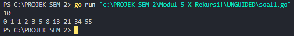
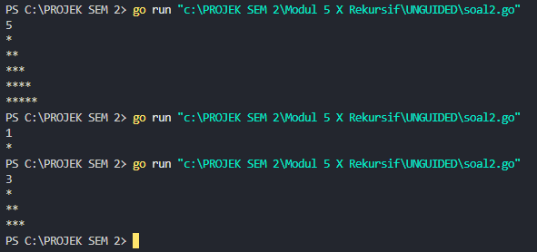
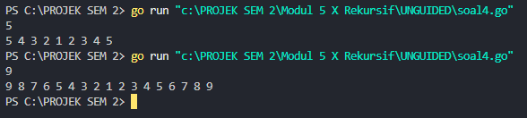
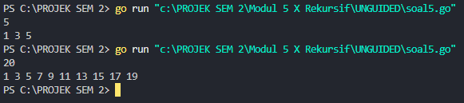
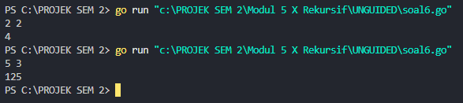

<h1 align="center">Laporan Praktikum Modul 4 <br>Prosedur</h1>
<p align="center">Muhammad Haidar Amanullah - 103112400262</p>

## Dasar Teori
Rekursi adalah teknik dalam pemrograman di mana sebuah fungsi memanggil dirinya sendiri untuk menyelesaikan suatu permasalahan. Rekursi biasanya digunakan untuk memecahkan masalah yang dapat dibagi menjadi sub-masalah yang lebih kecil dengan pola yang serupa. Dalam rekursif, terdapat dua bagian utama, yaitu base case dan recursive case. Base case akan menghentikan rekursif, sedangan recursive case adalah fungsi yang memanggil dirinya sendiri dengan parameter yang mendekati base case.

## Unguided

### Soal 1

>Deret fibonacci adalah sebuah deret dengan nilai suku ke-0 dan ke-1 adalah 0 dan 1, dan nilai suku ke-n selanjutnya adalah hasil penjumlahan dua suku sebelumnya. Secara umum dapat diformulasikan 𝑆𝑛 = 𝑆𝑛−1 + 𝑆𝑛−2 . Berikut ini adalah contoh nilai deret fibonacci hingga suku ke-10. Buatlah program yang mengimplementasikan fungsi rekursif pada deret fibonacci tersebut.

```go
package main

import "fmt"

func fibonacci(n int) int {
    if n < 2 {
        return n
    }
    return fibonacci(n-1) + fibonacci(n-2)
}

func cetakFibonacci(i, n int) {
    fmt.Print(fibonacci(i), " ")
    if i < n {
        cetakFibonacci(i+1, n)
    }
} 

func main() {
    var n int
    fmt.Scan(&n)
    cetakFibonacci(0, n)
}
```



#### Penjelasan

Kode ini digunakan untuk mengimplementasikan konsep rekursi dalam menghitung bilangan Fibonacci. Ketika program dijalankan, pengguna diminta memasukkan batas jumlah bilangan Fibonacci yang akan dicetak.

Sebagai contoh, jika input yang dimasukkan adalah 6, maka pola perhitungannya seperti berikut:
```
0 + 0 = 0
0 + 1 = 1
1 + 1 = 2
2 + 1 = 3
3 + 2 = 5
5 + 3 = 8
```

Sehingga output yang dihasilkan adalah:
```
0 1 1 2 3 5 8
```

#### Fungsi & Prosedur

##### 1. Fungsi `fibonacci`
```go
// Fungsi untuk menghitung bilangan Fibonacci secara rekursif
func fibonacci(n int) int {
	if n < 2 {
		return n
	}
	return fibonacci(n-1) + fibonacci(n-2)
}

```
Fungsi fibonacci(n) bekerja secara rekursif untuk menghitung bilangan Fibonacci ke-n.

- Jika n < 2, fungsi langsung mengembalikan n sebagai base case, sehingga rekursi berhenti.

- Jika n >= 2, fungsi akan memanggil dirinya sendiri dengan fibonacci(n-1) + fibonacci(n-2) hingga mencapai base case.  
Dengan kata lain, fungsi ini menghitung nilai Fibonacci dengan menjumlahkan dua bilangan sebelumnya.
##### 2. Prosedur cetakFibonacci
```go
// Fungsi rekursif untuk mencetak deret Fibonacci tanpa menggunakan return
func cetakFibonacci(i, n int) {
	fmt.Print(fibonacci(i), " ")
	if i < n {
		cetakFibonacci(i+1, n)
	}
}
```

Fungsi ini digunakan untuk mencetak deret bilangan Fibonacci secara rekursif.

- Fungsi mencetak hasil fibonacci(i) diikuti spasi
- Jika i masih lebih kecil dari n, maka fungsi cetakFibonacci memanggil dirinya sendiri dengan parameter yang diperbarui: cetakFibonacci(i+1, n).
- Rekursi berhenti ketika i sudah sama dengan n.

### Soal 2
> Buatlah sebuah program yang digunakan untuk menampilkan pola bintang berikut ini dengan menggunakan fungsi rekursif. N adalah masukan dari user.

<table border="1">
  <tr>
    <th>No</th>
    <th>Masukan</th>
    <th>Keluaran</th>
  </tr>
  <tr>
    <td>1</td>
    <td>5</td>
    <td>*<br>**<br>***<br>****<br>*****</td>
  </tr>
  <tr>
    <td>2</td>
    <td>1</td>
    <td>*</td>
  </tr>
  <tr>
    <td>3</td>
    <td>3</td>
    <td>*<br>**<br>***</td>
  </tr>
</table>

```go
package main

import "fmt"

func bintang(n int) {
	if n != 0 {
		fmt.Print("*")
		bintang(n - 1)
	}
}

func pola(n, baris int) {
	if baris <= n {
		bintang(baris)
		fmt.Println()
		pola(n, baris+1)
	}
}

func main() {
	var n int
	fmt.Scan(&n)
	pola(n, 1)
}
```


#### Penjelasan

Ketika program berjalan, pengguna akan diminta untuk memasukkan sebuah bilangan **n**, yang menentukan jumlah baris dalam pola segitiga bintang.
Setelah nilai **n** dimasukkan, program akan memanggil fungsi pola(n, 1). Fungsi ini bekerja secara rekursif untuk mencetak setiap baris pola bintang.
Pada setiap pemanggilan pola(n, baris):
- Fungsi bintang(baris) dipanggil untuk mencetak sejumlah bintang sesuai dengan nilai baris.
- Setelah itu, program berpindah ke baris berikutnya dengan memanggil pola(n, baris+1).
Proses ini akan terus berlangsung hingga nilai baris melebihi n, yang menjadi kondisi berhenti dari rekursi.

##### a. Prosedur bintang
```go
func bintang(n int) {
	if n != 0 {
		fmt.Print("*")
		bintang(n - 1)
	}
}
```
Fungsi ini digunakan untuk mencetak bintang sebanyak nilai n di dalam satu baris. Hal ini menggunakan rekursif untuk menyelesaikan perulangannya.

##### b. Prosedur pola
```go
func pola(n, baris int) {
	if baris <= n {
		bintang(baris)
		fmt.Println()
		pola(n, baris+1)
	}
}
```
Prosedur pola(n, baris) adalah prosedur rekursif yang digunakan untuk mencetak pola segitiga bintang. Jumlah bintang yang dicetak akan bertambah di setiap baris secara bertahap.
### Soal 3
> Buatlah program yang mengimplementasikan rekursif untuk menampilkan faktor bilangan dari suatu N, atau bilangan yang apa saja yang habis membagi N. Masukan terdiri dari sebuah bilangan bulat positif N. Keluaran terdiri dari barisan bilangan yang menjadi faktor dari N (terurut dari 1 hingga N ya).

<table border="1">
  <tr>
    <th>No</th>
    <th>Masukan</th>
    <th>Keluaran</th>
  </tr>
  <tr>
    <td>1</td>
    <td>5</td>
    <td>1 5</td>
  </tr>
  <tr>
    <td>2</td>
    <td>12</td>
    <td>1 2 3 4 6 12</td>
  </tr>
</table>

```go
package main

import "fmt"

func faktorBilangan(n, i int) {
	if i <= n {
		if n%i == 0 {
		fmt.Print(i, " ")
		}
		faktorBilangan(n, i+1)
	}
}

func main() {
	var n int
	fmt.Scan(&n)
	faktorBilangan(n, 1)
}
```


Ketika program berjalan, program akan meminta pengguna untuk memasukkan nilai n. Setelah nilai dimasukkan, proses dimulai dengan memanggil fungsi faktorBilangan(n, 1). Fungsi ini akan memeriksa apakah angka i (dimulai dari 1) adalah faktor dari n dengan cara memeriksa apakah n % i == 0. Jika iya, angka tersebut akan dicetak. Kemudian, fungsi akan memanggil dirinya sendiri dengan nilai i+1. Proses ini akan terus berlanjut sampai nilai i lebih besar dari n, yang menjadi kondisi berhenti untuk rekursi.

#### Prosedur faktor bilangan
```go
func faktorBilangan(n, i int) {
	if i <= n {
		if n%i == 0 {
		fmt.Print(i, " ")
		}
		faktorBilangan(n, i+1)
	}
}
```
Prosedur `faktorBilangan(n, i)` adalah prosedur rekursif yang bertugas mencari dan mencetak semua faktor dari bilangan `n`.

### Soal 4
> Buatlah program yang mengimplementasikan rekursif untuk menampilkan barisan bilangan tertentu. Masukan terdiri dari sebuah bilangan bulat positif N. Keluaran terdiri dari barisan bilangan dari N hingga 1 dan kembali ke N.

<table border="1">
  <tr>
    <th>No</th>
    <th>Masukan</th>
    <th>Keluaran</th>
  </tr>
  <tr>
    <td>1</td>
    <td>5</td>
    <td>5 4 3 2 1 2 3 4 5</td>
  </tr>
  <tr>
    <td>2</td>
    <td>9</td>
    <td>9 8 7 6 5 4 3 2 1 2 3 4 5 6 7 8 9</td>
  </tr>
</table>

```go
package main

import "fmt"

func barisan(n, angka int) {
	fmt.Print(angka, " ")
	if angka > 1 {
		barisan(n, angka-1)
		fmt.Print(angka, " ")
	}
}

func main() {

	var n int
	fmt.Scan(&n)
	barisan(n, n)

}
```

Ketika program dijalankan, pengguna akan diminta untuk memasukkan sebuah angka N. Setelah itu, program akan memanggil fungsi rekursif barisan(n, n), yang akan mencetak angka dari N hingga 1 secara menurun. Jika angka masih lebih besar dari 1, fungsi akan terus dipanggil dengan nilai yang berkurang satu demi satu sampai mencapai 1. Setelah mencapai 1, rekursi akan kembali naik dan mencetak angka dalam urutan naik hingga kembali ke N, sehingga menghasilkan pola simetris seperti contoh "5 4 3 2 1 2 3 4 5".
#### Prosedur barisan
```go
func barisan(n, angka int) {
	fmt.Print(angka, " ")
	if angka > 1 {
		barisan(n, angka-1)
		fmt.Print(angka, " ")
	}
}
```
Prosedur ini digunakan untuk mencetak angka dari n hingga 1, kemudian kembali lagi ke nilai awal n. Ketika program berjalan, nilai n akan masuk ke prosedur barisan dan diteruskan ke dua variabel yang berbeda, yaitu variabel n dan angka, yang berfungsi untuk menyimpan inputan. Sistem akan mencetak nilai awal dari n terlebih dahulu. Setelah itu, nilai n yang ada di variabel angka akan dicek, apakah lebih dari 1. Jika ya, maka nilai n dalam variabel angka akan dikurangi dengan 1, sehingga angka akan terus berkurang hingga mencapai 1. Setelah mencapai 1, rekursi akan kembali ke atas dan mencetak angka dalam urutan naik hingga kembali ke nilai awal n.
### Soal 5
> Buatlah program yang mengimplementasikan rekursif untuk menampilkan barisan bilangan ganjil. Masukan terdiri dari sebuah bilangan bulat positif N. Keluaran terdiri dari barisan bilangan ganjil dari 1 hingga N. Contoh masukan dan keluaran:

<table border="1">
  <tr>
    <th>No</th>
    <th>Masukan</th>
    <th>Keluaran</th>
  </tr>
  <tr>
    <td>1</td>
    <td>5</td>
    <td>1 3 5</td>
  </tr>
  <tr>
    <td>2</td>
    <td>20</td>
    <td>1 3 5 7 9 11 13 15 17 19</td>
  </tr>
	</table>

```go
package main

import "fmt"

func cetakGanjil(i, n int) {
	if i <= n {
		fmt.Print(i, " ")
		cetakGanjil(i+2, n)
	}
}

func main() {
	var n int
	fmt.Scan(&n)
	cetakGanjil(1, n)
}
```


Ketika program berjalan, program akan meminta input berupa nilai n. Nilai n ini kemudian akan dieksekusi oleh prosedur cetakGanjil, di mana kita menentukan nilai awal adalah 1. Nilai 1 akan dimasukkan ke dalam variabel i, yang kemudian akan dicek apakah nilai i <= n. Jika ya, maka program akan mencetak i dan menambahkan i dengan 2. Proses ini akan terus berjalan sampai nilai i sudah sama dengan atau lebih besar dari nilai n, sehingga program akan berhenti.

```go
func cetakGanjil(i, n int) {
	if i <= n {
		fmt.Print(i, " ")
		cetakGanjil(i+2, n)
	}
}
```
Prosedur ini digunakan untuk mencetak bilangan ganjil dari 1 hingga ke n


### Soal 6
> Buatlah program yang mengimplementasikan rekursif untuk mencari hasil pangkat dari dua buah bilangan. Masukan terdiri dari bilangan bulat x dan y. Keluaran terdiri dari hasil x dipangkatkan y. Catatan: diperbolehkan menggunakan asterik "", tapi dilarang menggunakan import "math". Contoh masukan dan keluaran:

<table border="1">
  <tr>
    <th>No</th>
    <th>Masukan</th>
    <th>Keluaran</th>
  </tr>
  <tr>
    <td>1</td>
    <td>2 2</td>
    <td>4</td>
  </tr>
  <tr>
    <td>2</td>
    <td>5 3</td>
    <td>125</td>
  </tr>
	</table>

```go
package main

import "fmt"

func pangkat(x, y int) int {
	if y == 0 {
		return 1
	}

	return x * pangkat(x, y-1)
}

func main() {
	var x, y int
	fmt.Scan(&x, &y)
	fmt.Println(pangkat(x, y))
}
```


Ketika program dijalankan, akan diminta sebuah 2 inputan, yaitu x dan y. x untuk angka utama, sedangkan y sebagai pangkat. Jadi program akan memeriksa, apakah nilai y == 0 atau tidak. Jika iya, maka otomatis outputnya adalah 1. Jika bukan 0, maka nilai dari x dikali dengan x, y-1.