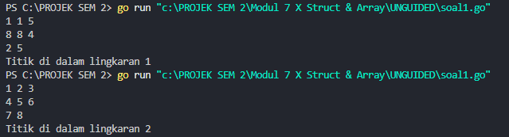
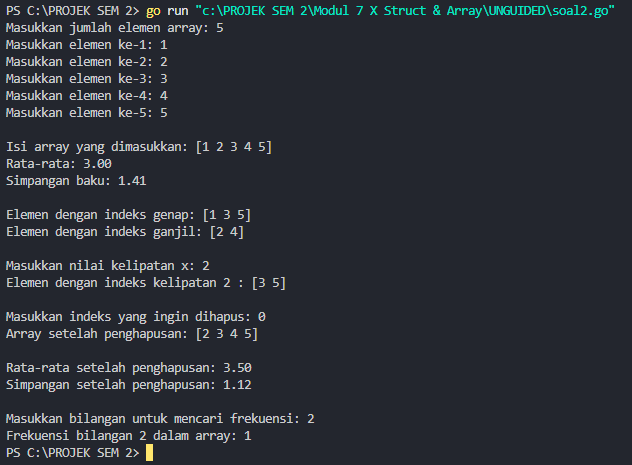
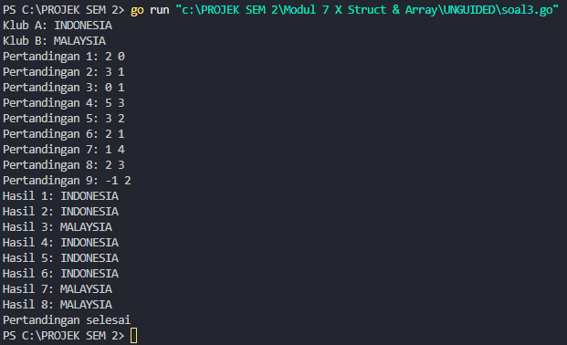
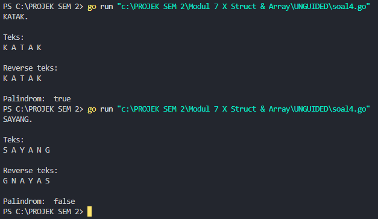

<h1 align="center">Laporan Praktikum Modul 4 <br>Prosedur</h1>
<p align="center">Muhammad Haidar Amanullah - 103112400262 </p>


## Dasar Teori
Struct dan Array adalah dua struktur data dasar dalam pemrograman Golang. Array digunakan untuk menyimpan kumpulan elemen dengan tipe data yang sama dalam satu variabel, diakses menggunakan indeks, dan memiliki ukuran tetap yang ditentukan saat deklarasi. Sebaliknya, Struct adalah tipe data yang memungkinkan pengelompokan berbagai jenis data ke dalam satu entitas, sehingga lebih fleksibel dibandingkan array. Struct sering digunakan untuk merepresentasikan objek dengan beberapa atribut, sedangkan array lebih cocok untuk menyimpan sekumpulan data yang memiliki karakteristik seragam.

## Unguided

### Soal 1
> Suatu lingkaran didefinisikan dengan koordinat titik pusat (𝑐𝑥, 𝑐𝑦) dengan radius 𝑟. Apabila diberikan dua buah lingkaran, maka tentukan posisi sebuah titik sembarang (𝑥, 𝑦) berdasarkan dua lingkaran tersebut. Gunakan tipe bentukan titik untuk menyimpan koordinat, dan tipe bentukan lingkaran untuk menyimpan titik pusat lingkaran dan radiusnya.
> Masukan terdiri dari beberapa tiga baris. Baris pertama dan kedua adalah koordinat titik pusat dan radius dari lingkaran 1 dan lingkaran 2, sedangkan baris ketiga adalah koordinat titik sembarang. Asumsi sumbu x dan y dari semua titik dan juga radius direpresentasikan dengan bilangan bulat.
> Keluaran berupa string yang menyatakan posisi titik "Titik di dalam lingkaran 1 dan 2", "Titik di dalam lingkaran 1", "Titik di dalam lingkaran 2", atau "Titik di luar lingkaran 1 dan 2".

<table border="1">
  <tr>
    <th>No</th>
    <th>Masukan</th>
    <th>Keluaran</th>
  </tr>
  <tr>
    <td>1</td>
    <td>1 1 5<br>8 8 4<br>2 2</td>
    <td>Titik di dalam lingkaran 1</td>
  </tr>
  <tr>
    <td>2</td>
    <td>1 2 3<br>4 5 6<br>7 8</td>
    <td>Titik di dalam lingkaran 2</td>
  </tr>
  <tr>
    <td>3</td>
    <td>5 10 15<br>-15 4 20<br>0 0</td>
    <td>Titik di dalam lingkaran 1 dan 2</td>
  </tr>
  <tr>
    <td>4</td>
    <td>1 1 5<br>8 8 4<br>15 20</td>
    <td>Titik di dalam lingkaran 1 dan 2</td>
  </tr>
</table>

```go
package main

import (
	"fmt"
	"math"
)

type Titik struct {
	x, y int
}

type Lingkaran struct {
	pusat  Titik
	radius int
}

func jarak(p, q Titik) float64 {
	return math.Sqrt(math.Pow(float64(p.x-q.x), 2) + math.Pow(float64(p.y-q.y), 2))
}

func didalam(c Lingkaran, p Titik) bool {
	return jarak(c.pusat, p) <= float64(c.radius)
}

func main() {
	var (
		cx1, cy1, r1 int
		cx2, cy2, r2 int
		x, y         int
	)

	fmt.Scan(&cx1, &cy1, &r1)
	fmt.Scan(&cx2, &cy2, &r2)
	fmt.Scan(&x, &y)

	lingkaran1 := Lingkaran{Titik{cx1, cy1}, r1}
	lingkaran2 := Lingkaran{Titik{cx2, cy2}, r2}
	titik := Titik{x, y}

	didalam1 := didalam(lingkaran1, titik)
	didalam2 := didalam(lingkaran2, titik)

	if didalam1 && didalam2 {
		fmt.Println("Titik di dalam lingkaran 1 dan 2")
	} else if didalam1 {
		fmt.Println("Titik di dalam lingkaran 1")
	} else if didalam2 {
		fmt.Println("Titik di dalam lingkaran 2")
	} else {
		fmt.Println("Titik di luar lingkaran 1 dan 2")
	}
}
```

#### a. Penjelasan
Program ini menerima input berupa koordinat pusat dan jari-jari dari dua lingkaran, serta koordinat sebuah titik. Dengan menggunakan rumus jarak:
```go
jarak = √((a - c)^2 + (b - d)^2)
```
program akan menghitung jarak antara titik dengan pusat masing-masing lingkaran. Berdasarkan hasil perhitungan tersebut, program akan menentukan apakah titik tersebut berada di dalam lingkaran pertama, lingkaran kedua, keduanya, atau di luar kedua lingkaran. Setelah evaluasi selesai, program akan menampilkan informasi mengenai posisi titik relatif terhadap kedua lingkaran.

#### b. Pemakaian Struct atau Tipe Data Kustom
Program ini menggunakan dua tipe data kustom, yaitu:
##### 1. Titik
```go
type Titik struct {
	x, y int
}
```
Tipe `Titik` digunakan untuk merepresentasikan sebuah koordinat dengan dua atribut, yakni `x` dan `y`, yang keduanya bertipe data integer.
##### 2. Lingkaran
```go
type Lingkaran struct {
	pusat  Titik
	radius int
}
```
Tipe `Lingkaran` menggambarkan sebuah lingkaran dengan atribut `pusat` yang bertipe `Titik` sebagai koordinat pusat lingkaran, dan `radius` yang bertipe integer untuk menyimpan nilai jari-jari lingkaran tersebut.
#### c. Pemanfaatan Fungsi
Selain tipe data bentukan, program ini juga menggunakan dua fungsi utama, yaitu:
##### 1. Fungsi `jarak`
```go
func jarak(p, q Titik) float64 {
	return math.Sqrt(math.Pow(float64(p.x-q.x), 2) + math.Pow(float64(p.y-q.y), 2))
}
```
Fungsi ini berfungsi untuk menghitung jarak antara dua titik menggunakan rumus jarak Euclidean yang sudah dijelaskan sebelumnya. Pada prosesnya, koordinat yang awalnya bertipe `int` diubah menjadi `float64` agar bisa dihitung menggunakan fungsi matematika. Kemudian, selisih koordinat `x` dan `y` di-kuadratkan, hasilnya dijumlahkan, dan akhirnya diambil akar kuadratnya dengan `math.Sqrt()`.
##### 2. Fungsi `didalam`
```go
func didalam(c Lingkaran, p Titik) bool {
	return jarak(c.pusat, p) <= float64(c.radius)
}
```
Fungsi `didalam` digunakan untuk menentukan apakah sebuah titik `p` berada di dalam lingkaran `c`. Caranya dengan membandingkan jarak titik tersebut ke pusat lingkaran dengan jari-jari lingkaran. Jika jaraknya kurang dari atau sama dengan radius, maka fungsi ini akan mengembalikan nilai `true` yang menandakan titik berada di dalam atau tepat pada batas lingkaran. Sebaliknya, jika jaraknya lebih besar, maka akan menghasilkan `false`, yang berarti titik berada di luar lingkaran.

---
### Soal 2
>Sebuah array digunakan untuk menampung sekumpulan bilangan bulat. Buatlah program
yang digunakan untuk mengisi array tersebut sebanyak N elemen nilai. Asumsikan array
memiliki kapasitas penyimpanan data sejumlah elemen tertentu. Program dapat
menampilkan beberapa informasi berikut:
a. Menampilkan keseluruhan isi dari array.
b. Menampilkan elemen-elemen array dengan indeks ganjil saja.
c. Menampilkan elemen-elemen array dengan indeks genap saja (asumsi indek ke-0 adalah
genap).
d. Menampilkan elemen-elemen array dengan indeks kelipatan bilangan x. x bisa diperoleh
dari masukan pengguna.
e. Menghapus elemen array pada indeks tertentu, asumsi indeks yang hapus selalu valid.
Tampilkan keseluruhan isi dari arraynya, pastikan data yang dihapus tidak tampil
f. Menampilkan rata-rata dari bilangan yang ada di dalam array.
g. Menampilkan standar deviasi atau simpangan baku dari bilangan yang ada di dalam array
tersebut.
h. Menampilkan frekuensi dari suatu bilangan tertentu di dalam array yang telah diisi
tersebut.

```go
package main

import (
	"fmt"
	"math"
)

func isiArray(jumlah int) []int {
	array := make([]int, jumlah)
	for i := 0; i < jumlah; i++ {
		fmt.Printf("Masukkan elemen ke-%d: ", i+1)
		fmt.Scan(&array[i])
	}
	return array
}

func ganjilGenap(array []int) ([]int, []int) {
	genap, ganjil := []int{}, []int{}
	for i := 0; i < len(array); i++ {
		if i%2 == 0 {
			genap = append(genap, array[i])
		} else {
			ganjil = append(ganjil, array[i])
		}
	}
	return genap, ganjil
}

func kelipatan(array []int, bilangan int) []int {
	hasil := []int{}
	for i := bilangan; i < len(array); i += bilangan {
		hasil = append(hasil, array[i])
	}
	return hasil
}

func hapusIndeks(array []int, indeks int) []int {
	if indeks < 0 || indeks >= len(array) {
		fmt.Println("Indeks tidak ditemukan")
		return array
	}
	return append(array[:indeks], array[indeks+1:]...)
}

func rataRata(array []int) float64 {
	total := 0
	for i := 0; i < len(array); i++ {
		total += array[i]
	}
	return float64(total) / float64(len(array))
}

func simpanganBaku(array []int) float64 {
	rata := rataRata(array)
	var jumlah float64
	for i := 0; i < len(array); i++ {
		jumlah += math.Pow(float64(array[i])-rata, 2)
	}
	return math.Sqrt(jumlah / float64(len(array)))
}

func frekuensi(array []int, angka int) int {
	jumlah := 0
	for i := 0; i < len(array); i++ {
		if array[i] == angka {
			jumlah++
		}
	}
	return jumlah
}

func main() {
	var jumlah, bilangan, indeks, angka int

	fmt.Print("Masukkan jumlah elemen array: ")
	fmt.Scan(&jumlah)

	if jumlah <= 0 {
		fmt.Println("Program berhenti karena jumlah elemen adalah <=0.")
		return
	}

	array := isiArray(jumlah)
	fmt.Println("\nIsi array yang dimasukkan:", array)
	fmt.Printf("Rata-rata: %.2f\n", rataRata(array))
	fmt.Printf("Simpangan baku: %.2f\n", simpanganBaku(array))

	genap, ganjil := ganjilGenap(array)
	fmt.Println("\nElemen dengan indeks genap:", genap)
	fmt.Println("Elemen dengan indeks ganjil:", ganjil)

	fmt.Print("\nMasukkan nilai kelipatan x: ")
	fmt.Scan(&bilangan)
	hasilKelipatan := kelipatan(array, bilangan)
	fmt.Println("Elemen dengan indeks kelipatan", bilangan, ":", hasilKelipatan)

	fmt.Print("\nMasukkan indeks yang ingin dihapus: ")
	fmt.Scan(&indeks)
	array = hapusIndeks(array, indeks)
	fmt.Println("Array setelah penghapusan:", array)

	fmt.Printf("\nRata-rata setelah penghapusan: %.2f\n", rataRata(array))
	fmt.Printf("Simpangan setelah penghapusan: %.2f\n", simpanganBaku(array))

	fmt.Print("\nMasukkan bilangan untuk mencari frekuensi: ")
	fmt.Scan(&angka)
	fmt.Printf("Frekuensi bilangan %d dalam array: %d\n", angka, frekuensi(array, angka))
}
```

#### a. Penjelasan
Program ini berfungsi untuk membuat dan mengelola sebuah array dinamis. Pada awal program, pengguna diminta memasukkan sebuah angka yang menentukan jumlah indeks (kapasitas) dari array yang akan dibuat. Setelah itu, program akan meminta pengguna mengisi elemen-elemen array tersebut satu per satu menggunakan pengulangan sampai jumlah elemen sesuai dengan kapasitas yang telah ditentukan.

Selain itu, program menyediakan beberapa fitur tambahan seperti menghapus elemen pada indeks tertentu, menghitung rata-rata nilai elemen dalam array, memilih elemen yang berada pada indeks kelipatan tertentu, menampilkan elemen berdasarkan indeks genap atau ganjil, serta mencari frekuensi kemunculan suatu nilai di dalam array.
#### b. Penjelasan Fungsi
##### 1. Fungsi `isiArray`
```go
func isiArray(jumlah int) []int {
	array := make([]int, jumlah)
	for i := 0; i < jumlah; i++ {
		fmt.Printf("Masukkan elemen ke-%d: ", i+1)
		fmt.Scan(&array[i])
	}
	return array
}
```
Fungsi ini bertugas untuk membuat sebuah array dengan panjang sesuai nilai `jumlah` yang diterima sebagai parameter. Fungsi menggunakan loop untuk meminta input elemen satu per satu dari pengguna hingga semua elemen terisi. Setelah selesai, fungsi mengembalikan array berisi elemen-elemen tersebut.
##### 2. Fungsi `ganjilGenap`
```go
func ganjilGenap(array []int) ([]int, []int) {
	genap, ganjil := []int{}, []int{}
	for i := 0; i < len(array); i++ {
		if i%2 == 0 {
			genap = append(genap, array[i])
		} else {
			ganjil = append(ganjil, array[i])
		}
	}
	return genap, ganjil
}
```
Fungsi ini memisahkan elemen-elemen dalam array ke dalam dua slice baru berdasarkan indeksnya, yaitu elemen dengan indeks genap dan ganjil. Indeks dimulai dari 0, sehingga indeks 0, 2, 4, dst., masuk ke dalam array genap, sedangkan indeks 1, 3, 5, dst., masuk ke array ganjil.
##### 3. Fungsi `kelipatan`
```go
func kelipatan(array []int, bilangan int) []int {
	hasil := []int{}
	for i := bilangan; i < len(array); i += bilangan {
		hasil = append(hasil, array[i])
	}
	return hasil
}
```
Fungsi ini mengambil elemen-elemen array yang berada pada indeks kelipatan dari parameter `bilangan`. Mulai dari indeks `bilangan`, kemudian indeks `2 * bilangan`, dan seterusnya, hingga akhir array. Jika nilai `bilangan` lebih besar dari panjang array, fungsi akan mengembalikan slice kosong.
##### 4. Fungsi `hapusIndeks`
```go
func hapusIndeks(array []int, indeks int) []int {
	if indeks < 0 || indeks >= len(array) {
		fmt.Println("Indeks tidak ditemukan")
		return array
	}
	return append(array[:indeks], array[indeks+1:]...)
}
```
Fungsi ini menghapus elemen pada posisi indeks yang diberikan. Sebelum menghapus, fungsi memeriksa apakah indeks valid (tidak kurang dari 0 dan tidak melewati panjang array). Jika indeks tidak valid, fungsi menampilkan pesan kesalahan dan mengembalikan array asli tanpa perubahan. Jika valid, elemen pada indeks tersebut dihilangkan dan array hasilnya dikembalikan.
##### 5. Fungsi `rataRata`
```go
func rataRata(array []int) float64 {
	total := 0
	for i := 0; i < len(array); i++ {
		total += array[i]
	}
	return float64(total) / float64(len(array))
}
```
Fungsi ini menghitung nilai rata-rata dari seluruh elemen dalam array. Total dari semua elemen dijumlahkan, kemudian dibagi dengan jumlah elemen array, dan hasilnya dikonversi ke tipe `float64` agar mendapatkan nilai desimal.

##### 6. Fungsi `simpanganBaku`
```go
func simpanganBaku(array []int) float64 {
	rata := rataRata(array)
	var jumlah float64
	for i := 0; i < len(array); i++ {
		jumlah += math.Pow(float64(array[i])-rata, 2)
	}
	return math.Sqrt(jumlah / float64(len(array)))
}
```
Fungsi ini digunakan untuk menghitung simpangan baku dari elemen array. Pertama-tama fungsi memanggil `rataRata` untuk memperoleh rata-rata nilai, kemudian menjumlahkan kuadrat selisih setiap elemen terhadap rata-rata. Hasil jumlah tersebut dibagi dengan jumlah elemen (populasi) dan diakarkan untuk mendapatkan simpangan baku.

##### 7. Fungsi `frekuensi`
```go
func frekuensi(array []int, angka int) int {
	jumlah := 0
	for i := 0; i < len(array); i++ {
		if array[i] == angka {
			jumlah++
		}
	}
	return jumlah
}
```
Fungsi ini menghitung berapa kali sebuah nilai `angka` muncul di dalam array. Fungsi menelusuri setiap elemen dan menambah penghitung `jumlah` setiap kali menemukan elemen yang sama dengan `angka`. Setelah selesai, nilai `jumlah` dikembalikan sebagai frekuensi kemunculan.
#### c. Main Program
```go
func main() {
	var jumlah, bilangan, indeks, angka int

	fmt.Print("Masukkan jumlah elemen array: ")
	fmt.Scan(&jumlah)

	if jumlah <= 0 {
		fmt.Println("Program berhenti karena jumlah elemen adalah <=0.")
		return
	}

	array := isiArray(jumlah)
	fmt.Println("\nIsi array yang dimasukkan:", array)
	fmt.Printf("Rata-rata: %.2f\n", rataRata(array))
	fmt.Printf("Simpangan baku: %.2f\n", simpanganBaku(array))

	genap, ganjil := ganjilGenap(array)
	fmt.Println("\nElemen dengan indeks genap:", genap)
	fmt.Println("Elemen dengan indeks ganjil:", ganjil)

	fmt.Print("\nMasukkan nilai kelipatan x: ")
	fmt.Scan(&bilangan)
	hasilKelipatan := kelipatan(array, bilangan)
	fmt.Println("Elemen dengan indeks kelipatan", bilangan, ":", hasilKelipatan)

	fmt.Print("\nMasukkan indeks yang ingin dihapus: ")
	fmt.Scan(&indeks)
	array = hapusIndeks(array, indeks)
	fmt.Println("Array setelah penghapusan:", array)

	fmt.Printf("\nRata-rata setelah penghapusan: %.2f\n", rataRata(array))
	fmt.Printf("Simpangan setelah penghapusan: %.2f\n", simpanganBaku(array))

	fmt.Print("\nMasukkan bilangan untuk mencari frekuensi: ")
	fmt.Scan(&angka)
	fmt.Printf("Frekuensi bilangan %d dalam array: %d\n", angka, frekuensi(array, angka))
}
```
Pada program utama tersebut terdapat pemeriksaan kondisi:
```go
if jumlah <= 0 {
	fmt.Println("Program berhenti karena jumlah elemen adalah <=0.")
	return
}
```
Tujuan dari kondisi ini adalah untuk memvalidasi input pengguna agar nilai jumlah elemen array yang dimasukkan harus bernilai positif (lebih dari nol). Jika pengguna memasukkan nilai nol atau negatif, program akan langsung berhenti agar tidak terjadi error atau perilaku yang tidak diinginkan selama proses pembuatan dan pengelolaan array.

---
### Soal 3
> Sebuah program digunakan untuk menyimpan dan menampilkan nama-nama klub yang memenangkan pertandingan bola pada suatu grup pertandingan. Buatlah program yang digunakan untuk merekap skor pertandingan bola 2 buah klub bola yang berlaga. Pertama-tama program meminta masukan nama-nama klub yang bertanding, kemudian program meminta masukan skor hasil pertandingan kedua klub tersebut. Yang disimpan dalam array adalah nama-nama klub yang menang saja. Proses input skor berhenti ketika skor salah satu atau kedua klub tidak valid (negatif). Di akhir program, tampilkan daftar klub yang memenangkan pertandingan. Perhatikan sesi interaksi pada contoh berikut ini (teks bergaris bawah adalah input/read)

```go
package main

import (
	"fmt"
)

func main() {
	var klubA, klubB string
	var skorA, skorB int
	var hasil []string

	fmt.Print("Klub A: ")
	fmt.Scan(&klubA)
	fmt.Print("Klub B: ")
	fmt.Scan(&klubB)

	pertandingan := 1
	for {
		fmt.Printf("Pertandingan %d: ", pertandingan)
		fmt.Scan(&skorA, &skorB)

		if skorA < 0 || skorB < 0 {
			break
		}

		if skorA > skorB {
			hasil = append(hasil, klubA)
		} else if skorA < skorB {
			hasil = append(hasil, klubB)
		} else {
			hasil = append(hasil, "Draw")
		}

		pertandingan++
	}

	for i, pemenang := range hasil {
		fmt.Printf("Hasil %d: %s\n", i+1, pemenang)
	}

	fmt.Println("Pertandingan selesai")
}
```


#### a. Penjelasan
Program ini berfungsi untuk menentukan hasil dari beberapa pertandingan antara dua klub, yaitu klub A dan klub B. Pada awalnya, pengguna diminta untuk memasukkan nama kedua klub tersebut. Setelah itu, program akan menjalankan sebuah loop yang berfungsi sebagai simulasi beberapa pertandingan antara kedua klub, di mana pengguna memasukkan skor dari klub A dan klub B untuk setiap pertandingan.

Proses penginputan skor akan terus berlanjut hingga pengguna memasukkan skor negatif, yang menjadi sinyal untuk menghentikan input dan keluar dari perulangan. Setelah semua skor pertandingan dimasukkan, program akan menampilkan ringkasan hasil pertandingan berupa daftar pemenang tiap pertandingan atau keterangan "Draw" jika hasilnya imbang.
```go
var hasil []string
```
yang digunakan untuk menyimpan hasil dari setiap pertandingan berupa nama klub pemenang atau kata "Draw" jika pertandingan berakhir imbang.

Kemudian, program melakukan pengecekan hasil setiap pertandingan menggunakan percabangan berikut:
```go
if skorA > skorB {
	hasil = append(hasil, klubA)
} else if skorA < skorB {
	hasil = append(hasil, klubB)
} else {
	hasil = append(hasil, "Draw")
}
```
Di sini, program membandingkan skor klub A dan klub B untuk menentukan pemenang. Jika skor klub A lebih besar, nama klub A disimpan di slice `hasil`. Jika skor klub B lebih besar, maka nama klub B yang disimpan. Jika skor sama, kata `"Draw"` yang ditambahkan.

Untuk menampilkan ringkasan hasil pertandingan, program menggunakan perulangan: 
```go
for i, pemenang := range hasil {
	fmt.Printf("Hasil %d: %s\n", i+1, pemenang)
}
```
Perulangan ini menampilkan setiap hasil pertandingan satu per satu, memberikan nomor urut dan siapa yang menang atau jika pertandingan seri.

---
### Soal 4
> Sebuah array digunakan untuk menampung sekumpulan karakter, Anda diminta untuk membuat sebuah subprogram untuk melakukan membalikkan urutan isi array dan memeriksa apakah membentuk palindrom.

```go
package main

import "fmt"

const NMAX int = 127
type tabel [NMAX]rune

func isiArray(t *tabel, n *int) {
	*n = 0
	var c rune
	for *n < NMAX {
		fmt.Scanf("%c", &c)
		if c == '.' {
			break
		}
		t[*n] = c
		*n++
	}
}

func cetakArray(t tabel, n int) {
	for i := 0; i < n; i++ {
		fmt.Printf("%c ", t[i])
	}
	fmt.Println()
}

func balikanArray(t *tabel, n int) {
	for i := 0; i < n/2; i++ {
		t[i], t[n-1-i] = t[n-1-i], t[i]
	}
}

func palindrom(t tabel, n int) bool {
	for i := 0; i < n/2; i++ {
		if t[i] != t[n-1-i] {
			return false
		}
	}
	return true
}

func main() {
	var tab tabel
	var m int

	isiArray(&tab, &m)

	fmt.Println("\nTeks: ")
	cetakArray(tab, m)

	balikanArray(&tab, m)

	fmt.Println("\nReverse teks: ")
	cetakArray(tab, m)

	fmt.Println("\nPalindrom: ", palindrom(tab, m))
}
```

#### a. Penjelasan
Program ini diawali dengan membaca karakter satu per satu ke dalam sebuah array, sampai jumlah maksimum karakter tercapai atau ditemukan tanda titik (`.`) sebagai tanda akhir input. Setelah proses input selesai, teks yang dimasukkan oleh pengguna akan ditampilkan.
Selanjutnya, program akan membalik urutan karakter yang ada di dalam array tersebut, kemudian mencetak hasil teks yang sudah dibalik.
Program kemudian melakukan pengecekan apakah teks tersebut merupakan palindrom, yaitu dengan membandingkan karakter dari awal dan akhir teks secara berpasangan. Jika semua pasangan karakter yang dibandingkan sama, maka teks dianggap sebagai palindrom, dan program akan mencetak `true`. Sebaliknya, jika ada pasangan karakter yang berbeda, maka teks bukanlah palindrom, dan program mencetak `false`.

#### b. Penggunaan Fungsi
Program ini menggunakan beberapa fungsi utama untuk mendukung operasinya, yaitu:
##### 1. Fungsi `isiArray`
```go
func isiArray(t *tabel, n *int) {
	*n = 0
	var c rune
	for *n < NMAX {
		fmt.Scanf("%c", &c)
		if c == '.' {
			break
		}
		t[*n] = c
		*n++
	}
}
```
Fungsi ini digunakan untuk membaca input karakter satu per satu dari pengguna dan menyimpannya ke dalam array `t`. Pengisian akan berhenti jika jumlah karakter sudah mencapai batas maksimum (`NMAX`) atau jika karakter titik (`.`) dimasukkan sebagai tanda akhir input. Nilai `n` akan menyimpan jumlah karakter yang sudah dimasukkan ke dalam array.

##### 2. Fungsi `cetakArray`
```go
func cetakArray(t tabel, n int) {
	for i := 0; i < n; i++ {
		fmt.Printf("%c ", t[i])
	}
	fmt.Println()
}
```
Fungsi ini bertugas untuk mencetak semua elemen dalam array `t` sebanyak `n` karakter. Setiap karakter akan dipisahkan oleh spasi, dan setelah selesai, program akan pindah ke baris baru.

##### 3. Fungsi `balikanArray`
```go
func balikanArray(t *tabel, n int) {
	for i := 0; i < n/2; i++ {
		t[i], t[n-1-i] = t[n-1-i], t[i]
	}
}
```
Fungsi ini digunakan untuk membalik urutan karakter di dalam array `t`. Proses pembalikan dilakukan dengan cara menukar elemen pertama dengan elemen terakhir, elemen kedua dengan elemen kedua terakhir, dan seterusnya hingga setengah dari panjang array.

##### 4. Fungsi `palindrom`
```go
func palindrom(t tabel, n int) bool {
	for i := 0; i < n/2; i++ {
		if t[i] != t[n-1-i] {
			return false
		}
	}
	return true
}
```
Fungsi ini digunakan untuk memeriksa apakah teks dalam array `t` merupakan palindrom atau bukan. Caranya dengan membandingkan pasangan karakter dari awal dan akhir array secara berpasangan. Jika semua pasangan karakter cocok, maka fungsi akan mengembalikan nilai `true`. Jika ada yang berbeda, fungsi akan mengembalikan `false`.